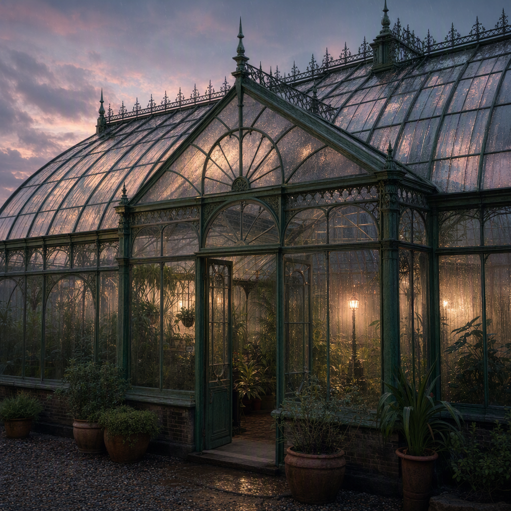

# Twilight Rain on the Glasshouse Roof

> Generated from Daybook. Do not edit as source data.

**Canonical ID:** `65f7043d-c654-44a5-a3f2-ae5de16ec402`  
**Status:** accepted  
**Category:** atmosphere  
**World:** Wychcombe (`wyc`)

## Narrative Details

As the last light of the day fades, the soft patter of rain on the glasshouse roofs becomes a quiet symphony. Droplets trail down warped panes of glass, refracting twilight into muted bands of soft pink and blue. The air inside the glasshouses, heavy with moisture and the green scent of growth, seems to exhale its warmth into the cool evening beyond. A gas lamp hums faintly at the far end, throwing long, wavering shadows onto the misted glass.

## Record Images

- **Primary:** [image-primary.png](../assets/atmospheres/65f7043d-c654-44a5-a3f2-ae5de16ec402-twilight-rain-on-the-glasshouse-roof/image-primary.png)
- **Reference:** [image-reference-01.png](../assets/atmospheres/65f7043d-c654-44a5-a3f2-ae5de16ec402-twilight-rain-on-the-glasshouse-roof/image-reference-01.png)

---
Generated from Daybook
Record ID: 65f7043d-c654-44a5-a3f2-ae5de16ec402
Last Updated: 2026-09-20T01:13:08.789Z
Snapshot Generated: 2026-09-20T01:13:08.789Z
