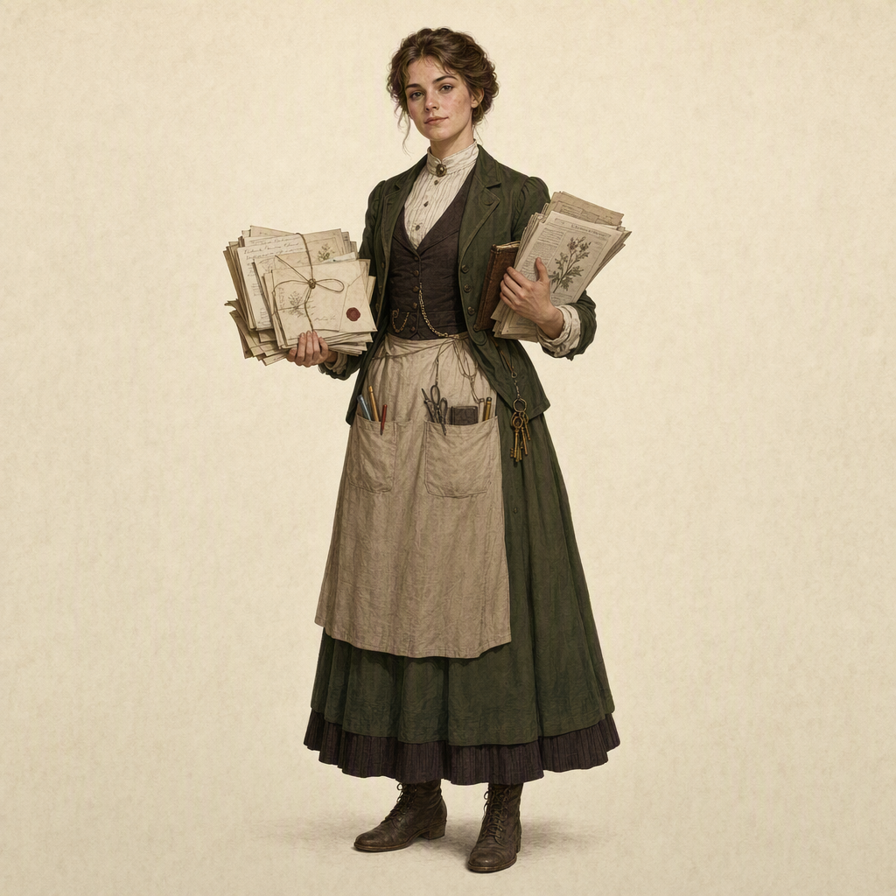

# Margaret Ashcroft

> Generated from Daybook. Do not edit as source data.

**Canonical ID:** `25473151-193d-4b27-8728-8e9fc8356b9a`  
**Status:** accepted  
**Category:** character  
**World:** Wychcombe (`wyc`)

## Narrative Details

Margaret Ashcroft was the eldest child of Elias and Clara Ashcroft and the first member of the Ashcroft family born into the world her parents were creating at Wychcombe.
Unlike Elias, Margaret did not have to discover that ordinary lives deserved preservation. She grew up surrounded by that assumption.
Her childhood unfolded between the estate and Wychcombe Village, among architectural drawings and botanical registers, nursery catalogs and household accounts, gardeners&#039; notes and family correspondence. Her father taught her, deliberately or otherwise, to notice the evidence people left in buildings and objects. Her mother taught her to observe living things over time and to recognize that useful knowledge could come from anyone willing to look carefully.
The Bellamy family provided another important influence. Through Clara&#039;s continued relationship with Bellamy & Son, Margaret grew up with close connections to a family for whom knowledge and commerce were not opposites. The nursery did not merely accumulate horticultural expertise. It packaged information into catalogs, answered correspondence, maintained customer relationships, exchanged plants and seeds, and moved knowledge outward through practical networks.
Margaret absorbed all of it.
As the eldest of three children, she developed a different relationship with Wychcombe from her younger siblings. James became fascinated by the physical estate and the practical work of building, repairing, and improving it. Cecily gravitated toward the living collections, eventually combining Clara&#039;s botanical discipline with her own talent for illustration.
Margaret moved between these worlds.
She was interested in the records Elias accumulated and the observations Clara maintained, but increasingly she asked a different question:
Who is all of this for?
Margaret came to believe that preservation without access could become another form of disappearance. A document carefully stored but never consulted, a botanical observation never shared, or a useful technique known only within one household might survive physically while becoming functionally lost.
Where Elias had learned to preserve evidence and Clara had learned to observe and organize it, Margaret became interested in circulation.
The Stationery House became the natural expression of that interest.
The building already existed when the Ashcrofts established themselves at Wychcombe and contained an old hand press and cases of worn type. Elias regarded the equipment initially as an interesting survival from the property&#039;s earlier history. Margaret eventually saw something more useful.
She saw infrastructure.
Under Margaret&#039;s influence, the Stationery House developed into a place where Wychcombe&#039;s accumulated knowledge could leave the estate and enter ordinary life. Botanical pamphlets, seasonal information, correspondence papers, practical publications, calendars, printed notices, educational materials, and other forms of useful print could carry ideas between Wychcombe, the village, neighboring communities, and eventually farther afield.
Margaret did not regard commerce as incompatible with preservation. Her Bellamy inheritance had taught her otherwise. A useful object could support the institution that produced it. A publication could preserve information while also paying for paper, wages, equipment, repairs, and future work.
She began imagining a Wychcombe that could sustain itself partly through participation rather than relying indefinitely upon private family wealth.
This distinguished Margaret from Elias without placing them in opposition.
Elias had spent much of his life asking what deserved to be preserved. Margaret accepted his answer and pushed it forward. If ordinary knowledge mattered, then ordinary people needed ways to encounter, use, contribute to, and carry that knowledge elsewhere.
Over time, Elias recognized that Margaret understood Wychcombe not simply as an estate but as a system. She could see connections between its buildings, records, gardens, village relationships, publications, finances, visitors, and future.
That recognition became central to Elias&#039;s eventual rejection of automatic primogeniture.
Margaret was not chosen to steward Wychcombe merely because she was the eldest child, nor because James or Cecily were incapable. Each of the Ashcroft children possessed a meaningful relationship with the place. Margaret&#039;s particular gift was understanding how those individual parts depended upon one another.
She understood not only what Wychcombe was, but what it might need to become in order to survive beyond the family that created it.
Margaret&#039;s stewardship therefore represents the second generation of the Wychcombe idea.
Elias and Clara made Wychcombe.
Margaret began teaching Wychcombe how to continue without them.

This also gives us a much cleaner foundation for the Stationery House. It isn&#039;t simply Margaret deciding that an old printing press would make a charming shop. It becomes her first major answer to the question that defines her character: How does preserved knowledge become living knowledge?

## Historical Context

Margaret Ashcroft was born into a period in which expanding literacy, cheaper printing, improved transportation, postal networks, and increasingly sophisticated commercial distribution were changing how information moved through British society. Printed material was becoming part of everyday life on a scale that earlier generations had not experienced, from newspapers and periodicals to catalogs, instructional pamphlets, advertisements, calendars, correspondence papers, and inexpensive books.

As the eldest daughter of Elias and Clara Ashcroft, Margaret nevertheless grew up within social expectations that placed significant limits on women&#039;s formal authority over property, institutions, and professional life. Her upbringing at Wychcombe complicated those expectations. Elias&#039;s own experience as a younger son had made him increasingly skeptical of inherited authority, while Clara came from the Bellamy family tradition of treating practical knowledge and ability as meaningful forms of contribution.

Margaret therefore grew up in a household that was socially privileged but increasingly unconventional in how it understood work, expertise, and responsibility.

Her maternal connection to Bellamy & Son, Nurserymen and Seedsmen was particularly important. Commercial horticulture depended not only upon growing and selling plants but upon maintaining records, corresponding with customers and suppliers, distributing catalogs and information, tracking orders, and building a reputation beyond the immediate community. Margaret could therefore encounter publishing and distribution not merely as intellectual activities but as practical tools of commerce and communication.

This background helps explain her later interest in the Stationery House. Printing during Margaret&#039;s lifetime could serve many functions simultaneously: commercial, educational, administrative, social, and cultural. A small press did not need to aspire to become a major publishing house to exert influence. It could produce materials useful to a village, an estate, local businesses, schools, gardeners, visitors, and correspondents farther afield.

Margaret&#039;s interest in circulation also emerged during a period when women were increasingly participating in publishing, education, charitable organizations, commercial enterprises, authorship, editing, illustration, and other forms of public intellectual life, even while significant legal and social restrictions remained. Her work should therefore be historically distinctive without requiring her to behave as though those restrictions did not exist.

Her eventual position within Wychcombe also challenged conventional expectations of inheritance. Elias had been raised within a family structure in which property and authority were expected to concentrate around the eldest male heir. His decision to recognize Margaret as Wychcombe&#039;s future steward represented a deliberate departure from that model.

Importantly, Margaret&#039;s succession should not be framed simply as Elias making an unusually progressive decision about his daughter. It developed from the philosophy Elias and Clara had already established within their family: stewardship should follow understanding, responsibility, and ability rather than automatic entitlement.

Margaret&#039;s historical importance therefore lies partly in the way she connects several changes already underway around her. She belongs to a generation for whom print, commerce, education, communication, and women&#039;s participation in public life were expanding, while older systems of class, gender, property, and inheritance remained powerful.

Wychcombe gives her an unusual place from which to negotiate those forces.

Rather than rejecting her parents&#039; preservation philosophy, Margaret adapts it to the possibilities of her own generation. Where Elias and Clara established systems for preserving and recording knowledge, Margaret begins exploring how that knowledge might circulate, generate income, reach new audiences, and sustain Wychcombe beyond dependence upon inherited wealth.

## Visual Notes

Margaret should be depicted as observant, capable, organized, and actively engaged with the systems of Wychcombe. Her visual identity should distinguish her from both Elias and Clara while retaining recognizable traces of their influence.

Where Elias is surrounded by architectural plans and Clara by botanical observations, Margaret is associated with paper in motion: correspondence waiting to be answered, proofs being reviewed, pamphlets being assembled, ledgers tracking costs and distribution, catalogs, calendars, envelopes, parcels, printing samples, lists, and stacks of material intended to leave Wychcombe rather than remain stored within it.

Her strongest recurring setting should eventually become the Stationery House, but Margaret should also appear throughout Wychcombe. She moves between the estate, village, gardens, family workspaces, Bellamy & Son, and other institutions because her particular strength is recognizing how separate parts of Wychcombe connect.

Worktables are important to Margaret&#039;s visual language. Unlike Elias&#039;s architectural table or Clara&#039;s botanical workspace, Margaret&#039;s surfaces should suggest organization and circulation. A botanical illustration might sit beside a printer&#039;s proof, a nursery record beside a draft pamphlet, correspondence beside an account ledger, or several versions of a printed piece arranged for review.

She should frequently be shown handling, reading, sorting, annotating, packaging, discussing, or distributing material. Avoid repeatedly portraying her sitting passively with an open book. Margaret does not merely consume information. She decides what happens to it next.

Printing equipment should be depicted as working technology rather than picturesque decoration. Type cases, composing tools, ink, rollers, presses, drying sheets, paper stocks, binding materials, proof pages, waste paper, string, parcels, and storage should create a sense of an active production environment. Margaret should be comfortable within that environment rather than appearing as a visitor to it.

Her clothing should reflect her position as the daughter of a prosperous household while remaining practical enough for regular work. She may be more polished in public or commercial settings, but she should not be visually defined by elaborate fashionable dress. Sleeves adjusted for work, an apron or protective layer when appropriate, ink on a finger, a pencil or note tucked nearby, or keys and practical personal objects can quietly reinforce her role.

Margaret&#039;s visual relationship with other characters should reinforce her ability to connect their work. With Elias, she may review records or discuss plans. With Clara, botanical observations can become material for publication. With James, she may consider how a physical space needs to function. With Cecily, illustrations may move from observational journals toward reproducible printed material.

Scenes involving Wychcombe Village should not position Margaret above the community dispensing knowledge outward. She should also be receiving information, requests, orders, corrections, stories, and contributions. Circulation works in both directions.

As Margaret matures into stewardship, her visual language can broaden. Earlier images may emphasize curiosity, experimentation, paper, and the press. Later images can incorporate correspondence networks, financial records, estate documents, visitor materials, schedules, keys, maps, and other evidence that she increasingly understands Wychcombe as an interconnected institution.

Avoid portraying Margaret as a society heiress, genteel hobbyist, passive archivist, romanticized Victorian writer, or modern executive transplanted into period clothing. Her authority should emerge through competence, familiarity, relationships, and repeated responsibility rather than theatrical symbols of power.

A particularly useful recurring visual motif is Margaret standing between accumulation and departure: records and source materials on one side of a working table, finished printed pieces, correspondence, or parcels on the other.

Elias preserves. Clara observes. Margaret&#039;s visual language should answer the next question:

Where does the knowledge go from here?

## Canon Notes and Open Questions

Exact birth and death dates remain open. These should be established when we build the complete founding-generation chronology from Elias and Clara&#039;s meeting through Margaret&#039;s stewardship.

Margaret&#039;s age when she first becomes involved with the Stationery House remains open. Her interest should develop over time rather than appearing fully formed. Determine when she first encounters the press, when she begins experimenting with it, and when the Stationery House becomes a serious undertaking.

The Stationery House chronology requires deliberate resolution. Existing canon associates the building and old printing equipment with the property Elias acquired, while other material identifies 1884 as the Stationery House&#039;s founding date. A likely distinction between the older building/equipment and Margaret&#039;s later establishment of the Stationery House as an institution should be explored, but not canonized until the timeline supports it.

Margaret&#039;s education needs definition. Determine whether she was educated primarily at Wychcombe, had tutors or governesses, attended school elsewhere, or received some combination. Her education should help explain her competence without making her abilities appear effortless.

Her printing education also needs an origin. Margaret should have to learn the craft. Determine who teaches her typesetting, press operation, printing, paper selection, binding, accounting, and the commercial side of production. This person does not necessarily need to be an Ashcroft and could become an important village character.

Her relationship with commerce should develop rather than be innate. Clara and the Bellamys provide Margaret with a model of respectable commercial enterprise, but Margaret still needs experience learning what people will actually buy, what things cost to produce, and how difficult sustainable operation can be.

Do not make the Stationery House immediately successful. Margaret&#039;s ideas may be good without every idea working. Early publications can sell poorly, production can be inefficient, equipment can fail, and some projects can cost more than they earn. Her competence becomes more convincing if it is acquired.

Margaret&#039;s eventual stewardship needs its own development. Determine when Elias first recognizes her ability to understand Wychcombe as a whole, when Margaret realizes she might someday be responsible for it, and whether she initially wants that responsibility.

Define Margaret&#039;s relationships with James and Cecily independently of succession. They should first be siblings with shared childhood, affection, disagreements, collaborations, and separate ambitions. Margaret becoming steward should not retroactively turn their relationships into an inheritance contest.

Margaret&#039;s personal life remains open. Marriage, romantic relationships, children, friendships, and the question of the next generation should not be assumed merely because she becomes Wychcombe&#039;s steward.

Her relationship with Wychcombe Village should be reciprocal. Margaret should not become the benevolent estate woman who decides what information the village needs. The Stationery House should give us opportunities for villagers to commission work, contribute information, correct publications, purchase goods, bring news, teach Margaret things, and influence what the institution becomes.

Keep Margaret distinct from the future Curators. She can establish practices that later influence them, but she should not behave as though she already understands or intends the eventual Curator institution. That development belongs to later generations.

## Related Production Specs

- Curator’s Desk Archival Washi Tape (`70d93d76-9eee-40ef-ac44-ec67457a95b7`)
- Curator’s Desk Botanical Study — Decorative Paper (`cd53fec9-a7bb-4461-bd9b-b04f5112b490`)
- Curator's Desk Hero Paper (`cc660670-61c6-4a33-9f8f-dcb28c4572e3`)
- Curator's Desk Notepaper (`167b9103-b9f0-4da1-8d66-301e99f01805`)

## Related Prompt Modules

- Atmospheric Grounding — Volume I (`165b33f4-2a08-4bd6-9c03-3e6f7e26b582`)
- Curatorial Evidence Language — Wychcombe (`ae5b5847-d4a8-4d90-a2d8-8b098859e83b`)
- Illustrated Archival Style Lock — Volume I (`b468de1b-d739-4163-8f4e-5e91eb191d98`)
- Material World — Volume I (`454a494b-8355-46ff-b1d1-599061eb5103`)
- Period & Digital Exclusions — Volume I (`c86f156d-27f7-49fc-b6d7-111184e98863`)
- Quiet Composition — Volume I (`638a6508-1e7e-4531-aa5a-9b9df53404fd`)

## Record Images

- **Primary:** [portrait-primary.png](../assets/characters/25473151-193d-4b27-8728-8e9fc8356b9a-margaret-ashcroft/portrait-primary.png)

---
Generated from Daybook
Record ID: 25473151-193d-4b27-8728-8e9fc8356b9a
Last Updated: 2026-09-19T14:48:13.497Z
Snapshot Generated: 2026-09-19T14:48:13.822Z
