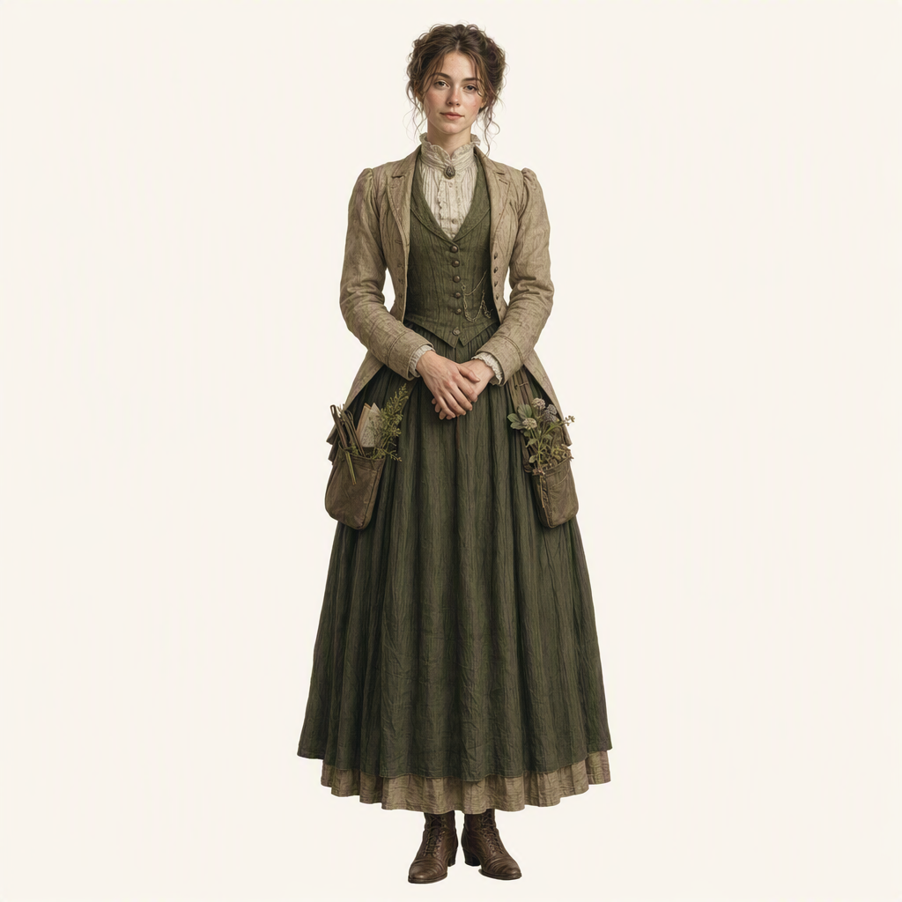

# Cecily Ashcroft

> Generated from Daybook. Do not edit as source data.

**Canonical ID:** `cce3c21b-1662-4c85-906f-669cb4ac1197`  
**Status:** accepted  
**Category:** character  
**World:** Wychcombe (`wyc`)

## Narrative Details

Margaret&#039;s younger sister, devoted to Wychcombes greenhouse and botanical preservation, creator of illustrated plant journals documenting the estate&#039;s living collections.

## Record Images

- **Primary:** [portrait-primary.png](../assets/characters/cce3c21b-1662-4c85-906f-669cb4ac1197-cecily-ashcroft/portrait-primary.png)

---
Generated from Daybook
Record ID: cce3c21b-1662-4c85-906f-669cb4ac1197
Last Updated: 2026-09-19T15:20:18.451Z
Snapshot Generated: 2026-09-19T15:20:18.639Z
