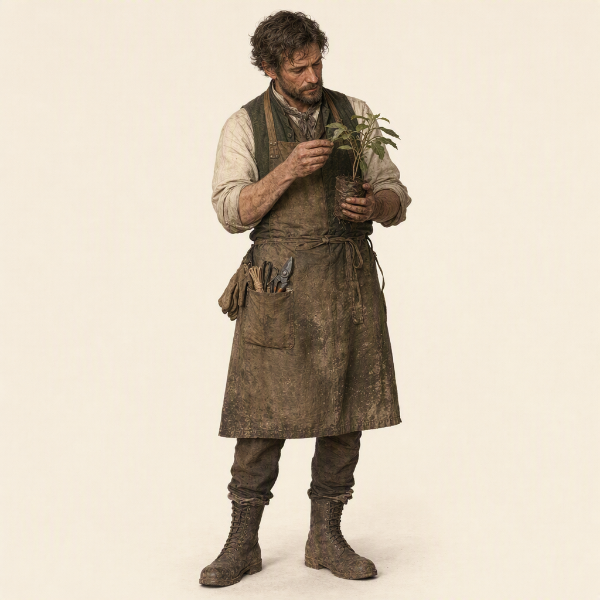

# Thomas Vale

> Generated from Daybook. Do not edit as source data.

**Canonical ID:** `d3fe713a-a407-4a37-bef2-eb675466b190`  
**Status:** accepted  
**Category:** character  
**World:** Wychcombe (`wyc`)

## Narrative Details

Thomas Vale was already working the gardens and glasshouses of the property near Wychcombe Village when Elias Ashcroft first arrived to conduct his architectural survey.

By then, Vale had spent years learning the property through work.

He knew which walls held warmth after sunset, which beds remained wet after heavy rain, where frost settled first, which glasshouse panes repeatedly failed in winter weather, which fruit trees still produced reliably, and which plants survived despite years of declining investment in the estate.

Much of this knowledge existed nowhere except in his memory and in the practical records maintained by gardeners.

The deterioration of the property had changed Vale&#039;s work considerably. Buildings and garden structures that had once been maintained routinely were increasingly repaired only when necessary. Glass was replaced selectively. Heating systems became unreliable. Plant collections contracted. Some cultivated areas were abandoned while others survived because Vale and the remaining workers concentrated limited resources where they would do the most good.

To an outside observer, parts of the garden appeared neglected.

Vale understood them differently.

He knew what had been lost, what had merely gone dormant, what could still be recovered, and what was being kept alive through increasingly improvised means.

When Elias arrived, Vale initially regarded him as another professional man sent to inspect the property and produce conclusions for people who did not work there.

Elias asked about construction dates, alterations, drainage, glasshouses, walls, and outbuildings. Vale answered when he could, but many of Elias&#039;s questions revealed the limitations of the surviving architectural record.

A wall might have one construction date and decades of subsequent repairs. A glasshouse might appear to belong to one period while containing heating systems, glazing, benches, and planting arrangements from several others.

Vale repeatedly redirected Elias from what a structure had originally been toward how it had actually been used.

It was Vale who pointed Elias toward Bellamy & Son when Elias began asking questions about the old glasshouses and their planting history.

"You&#039;ll want Bellamy&#039;s."

The recommendation eventually brought Elias into contact with Clara Bellamy.

Vale could tell Elias how the glasshouses behaved. Clara could help explain what generations of gardeners had been trying to accomplish within them.

Together, their knowledge began revealing a history that the estate&#039;s formal records could not.

Vale became one of the people through whom Elias learned an essential lesson about Wychcombe: expertise did not necessarily belong to the person with the title, education, or ownership papers.

Elias could read a building.

Vale could tell him where it failed every February.

Clara could tell him why someone had needed it to work in the first place.

As Elias and Clara began transforming the property into Wychcombe, Vale remained part of its gardening life. His knowledge provided continuity between the estate that existed before them and the one they were attempting to create.

His relationship with Clara developed around a shared seriousness about horticultural observation. Clara brought the systematic practices of Bellamy & Son, including phenological observation, propagation records, source information, and organized botanical documentation. Vale brought years of intimate knowledge of one particular landscape.

Neither form of expertise replaced the other.

Clara could introduce more systematic methods of recording observations while discovering that Vale carried information no ledger could reconstruct. Vale could be skeptical of unnecessary documentation while gradually recognizing that records might preserve knowledge that would otherwise disappear when the person carrying it did.

Their collaboration becomes one of the foundations of Wychcombe&#039;s gardening tradition.

Vale is therefore important not because he becomes an Ashcroft servant of particular prominence, but because he is a point of continuity.

He remembers the gardens before Wychcombe became Wychcombe.

As Margaret, James, and Cecily grow up, Vale becomes one of the adults through whom they encounter that earlier landscape. Cecily in particular can eventually benefit from his practical knowledge as her botanical interests develop, although the exact nature of their relationship remains to be established.

His records, annotations, planting notes, corrections, and accumulated observations may survive among Wychcombe&#039;s gardening materials alongside those of Clara, Cecily, and later gardeners.

Some are careful.

Some are abbreviated.

Some assume that whoever reads them already knows precisely what Thomas Vale meant.

And occasionally, decades later, someone does not.

## Historical Context

Thomas Vale belongs to a long tradition of professional and estate gardening in nineteenth-century Britain. Large country properties depended upon skilled gardeners to maintain productive kitchen gardens, orchards, ornamental grounds, nurseries, glasshouses, and collections of plants requiring specialized cultivation.

By the time Elias Ashcroft arrived near Wychcombe, gardening on such properties had become increasingly technical. Glasshouses, heating systems, propagation techniques, soil preparation, pruning, grafting, seed saving, pest management, drainage, and the cultivation of imported or tender plants required substantial practical knowledge. Much of that expertise was acquired through apprenticeship, observation, repetition, and knowledge passed between gardeners rather than through formal academic education.

A gardener in Vale&#039;s position could therefore possess an extraordinarily detailed understanding of a property while holding comparatively little formal authority over it.

The declining condition of the pre-Ashcroft estate would have directly affected his work. Reduced household finances or changing priorities could mean fewer workers, delayed repairs, reduced fuel for heated glasshouses, difficulty replacing broken glazing, declining plant collections, and pressure to concentrate labor on the portions of the gardens considered most useful or salvageable.

Vale&#039;s work during this period should reflect managed decline rather than simple neglect. Beds might be consolidated, tender plants moved to the most reliable structures, propagation used to preserve specimens that could no longer be maintained in quantity, and damaged infrastructure kept functioning through practical repairs.

This history explains why the condition Elias encounters cannot be read accurately from appearance alone. Some seemingly neglected areas may represent deliberate decisions made by Vale and other workers to preserve what they could with diminishing resources.

Estate gardeners also participated in wider networks of horticultural knowledge. Plants, seeds, cuttings, techniques, catalogs, correspondence, and professional information moved among private estates, commercial nurseries, gardeners, horticultural societies, and suppliers. Bellamy & Son would therefore not have been socially or professionally remote from Vale&#039;s work. A longstanding relationship between the nursery and the property&#039;s gardeners is plausible and should be explored when the earlier history of both is developed.

Vale&#039;s knowledge differs in important ways from Clara Bellamy&#039;s. Clara comes from a commercial nursery environment where records, propagation, customer relationships, plant sources, seasonal observations, and the movement of horticultural material are central to the business. Vale&#039;s expertise is deeply site-specific. He understands how this particular piece of land behaves across seasons and years.

Their eventual collaboration at Wychcombe brings those traditions together.

Vale also represents an important distinction within Wychcombe&#039;s developing preservation philosophy. Nineteenth-century historical records often preserve the decisions of owners, architects, and institutions more clearly than the knowledge of the people responsible for maintaining places from day to day. Gardeners could profoundly shape landscapes while leaving comparatively limited documentary evidence of their own lives and decisions.

Elias&#039;s increasing reliance upon Vale&#039;s knowledge therefore becomes part of his broader recognition that ownership records alone cannot adequately describe the history of a place.

Thomas Vale predates the Ashcroft identity of the estate. He worked the land before Elias arrived, remained through the property&#039;s transition into Wychcombe, and became one of the human connections between those two periods.

For the later historical record, that makes Vale more than Wychcombe&#039;s first Ashcroft-era gardener.

He is evidence that Wychcombe had a history before anyone began deliberately preserving it.

## Visual Notes

Thomas Vale should appear first and foremost as a working gardener whose appearance has been shaped by years outdoors. He is practical rather than picturesque, comfortable among plants, tools, soil, glasshouses, and workspaces in a way he rarely appears comfortable in formal interiors.

His clothing should reflect the work being performed rather than serve as generic Victorian costume. Practical trousers, sturdy boots, shirts with sleeves adjusted for work, waistcoats or jackets when appropriate, work aprons, hats, gloves, and weather protection can vary by season and task. Clothing should show restrained signs of repeated use, repair, soil, water, and wear.

His hands are particularly important. They should look accustomed to pruning, propagation, potting, tying, lifting, repairing, and handling tools. When depicting Thomas, his hands should often be occupied.

Thomas should rarely be posed simply looking at a garden.

He should be doing something within it.

He may be checking new growth, turning a leaf to examine its underside, testing soil, pruning, tying a plant, inspecting glass, carrying pots, adjusting ventilation, preparing propagation material, repairing a frame, writing a brief note, or standing still long enough to observe something before returning to work.

His visual environment should reinforce the extraordinary specificity of his knowledge. He knows particular walls, beds, glasshouses, paths, trees, drainage problems, sheltered corners, and recurring trouble spots. Repeated locations across imagery can subtly establish that familiarity.

Thomas is most visibly at ease when he is alone or with one or two familiar people.

Crowded interiors, formal gatherings, large meals, busy village events, and situations requiring sustained social performance are difficult for him. This should not be visually coded as fearfulness, hostility, intellectual deficiency, or dislike of people. Instead, his discomfort can appear through restraint: remaining near the edge of a gathering, choosing a quieter workspace, stepping outside when a room becomes crowded, speaking to one person rather than a group, or finding a practical task that gives him a reason to move away from commotion.

He does not need to be visibly distressed in every social scene. This is part of how Thomas navigates the world, not his entire characterization.

Thomas and Clara

His visual language changes subtly around Clara Bellamy Ashcroft.

Clara is one of the relatively few people Thomas actively makes room for.

He may remain working when she joins him rather than stopping to entertain her. Their conversations can happen while repotting plants, inspecting a glasshouse, walking a garden boundary, comparing records, sorting seeds, or examining something that has changed since the previous season.

Their friendship should feel comfortable enough that silence counts as company.

Thomas does not suddenly become animated or socially effortless around Clara. Instead, his ease appears through small differences. He remains when he might otherwise leave. He brings something to show her. He waits for her opinion. He allows her into his working space without treating her presence as an interruption.

And occasionally, he goes somewhere for her that he would normally avoid.

A Bellamy family supper, an Ashcroft gathering, a presentation of botanical work, a celebration, or another crowded occasion might include Thomas not because he enjoys such events, but because Clara asked him to come and it mattered to her.

In those scenes, he might remain near a doorway, window, garden entrance, or quieter edge of the room. Clara does not hover over him or attempt to manage him. She simply knows where he is.

That distinction should be preserved visually. Their affection is based upon understanding rather than caretaking.

Thomas and Elias

Early images with Elias should contain more physical distance.

Thomas may continue working while answering Elias&#039;s questions rather than standing formally for an interview. Elias initially carries notebooks, plans, and measuring instruments while Thomas remains surrounded by the physical evidence Elias is attempting to understand.

Over time, their compositions can change.

Instead of Elias questioning Thomas while taking notes, the two might eventually stand over the same damaged frame, drainage channel, wall, or planting bed. Elias&#039;s plans and Thomas&#039;s practical observations begin occupying the same working surface.

Their growing respect should be visible before it is stated.

Thomas and the Children

Later imagery can soften further around Margaret, James, and particularly Cecily.

Thomas should not become the sentimental old gardener surrounded by adoring children. He is still Thomas.

A child who wants his attention may discover that the easiest way to receive it is to work beside him.

Cecily&#039;s developing botanical interest creates particularly strong visual possibilities. She might sketch while Thomas works, bring him a specimen she cannot identify, compare one of Clara&#039;s records against what is actually growing, or receive an extremely specific correction to something she has drawn.

Thomas does not necessarily praise easily. His investment is demonstrated by the amount of knowledge he is willing to give.

Records and Objects

Thomas&#039;s written material should look different from Clara&#039;s systematic botanical records and Cecily&#039;s later illustrated journals.

His notes are working documents.

They may contain abbreviated observations, planting dates, weather marks, quantities, rough diagrams, propagation results, reminders, corrections, practical symbols, reused pieces of paper, labels, or annotations added to older records.

Some entries may be beautifully precise. Others may make perfect sense only to Thomas.

This gives us an important visual precedent for the planner without requiring the planner itself to belong to him.

A later Wychcombe gardener could encounter a terse Vale annotation and wonder:

What on earth did he mean by that?

Core Visual Principle

Thomas should look most himself when nobody appears to be watching.

The visual signature of the character is not solitude itself. It is the contrast between the effort required for him to enter the human world and the effortless attention he gives the living one.

Clara occupies a special place between those worlds.

Thomas does not make time for many people. He makes time for Clara.

## Canon Notes and Open Questions

Thomas&#039;s difficulty with social environments should remain undesignated for now. He finds crowds, prolonged social interaction, unfamiliar people, and socially demanding situations difficult or exhausting. Do not assign a modern medical, psychological, or neurodevelopmental diagnosis unless later story development requires one.

His social difficulty is not equivalent to disliking people. Thomas can form deep attachments, work effectively with others, teach, collaborate, disagree, and participate in community life. He simply prefers interactions that are quieter, purposeful, familiar, or one-to-one.

Do not make his social difficulty his defining characteristic. Thomas is first an experienced gardener with extensive site-specific knowledge. His temperament affects how he moves through the world but should never eclipse his horticultural expertise.

Clarify Thomas&#039;s age and career chronology. Determine approximately how old he is when Elias arrives, how long he has already worked on the property, whether he began there as a boy or arrived as an experienced gardener, and whether another gardener originally trained him.

Define his formal position before Elias arrives. Determine whether Thomas is already head gardener, becomes responsible as staffing declines, or holds another gardening position. His authority should fit the size and declining circumstances of the pre-Ashcroft property.

Develop Thomas&#039;s life outside the estate. Determine where he lives, whether he has living relatives, his connection to Wychcombe Village, and whether he has friendships or relationships beyond the Ashcroft and Bellamy families. He should not exist solely within the estate gates.

His relationship with Bellamy & Son predates Clara&#039;s relationship with Elias. Determine how long Thomas has dealt with the nursery and whom he knows there. His recommendation, "You&#039;ll want Bellamy&#039;s," should come from an established professional relationship rather than narrative convenience.

Develop Thomas and Clara&#039;s friendship as its own relationship. Their connection should not exist merely to introduce Clara to Elias. They share horticultural expertise but approach knowledge differently. Clara&#039;s systematic observation and Thomas&#039;s intensely site-specific knowledge should sometimes produce disagreement as well as collaboration.

Clara is one of Thomas&#039;s exceptional relationships. He willingly gives her time and occasionally enters situations he would normally avoid because her presence matters to him. Keep this affection clearly distinct from romance unless we deliberately decide otherwise later. The current direction is a profound friendship built on trust, work, and mutual understanding.

Clara should not "fix" Thomas socially. She understands his limits without managing him, translating him for everyone else, or forcing him into greater sociability as evidence of personal growth.

Elias must earn Thomas&#039;s respect. Thomas should not immediately embrace Elias&#039;s preservation project simply because Elias is the founder. Their relationship should develop as Thomas observes that Elias listens to workers, records their knowledge, changes his conclusions when evidence contradicts them, and eventually acts upon what he learns.

Determine Thomas&#039;s relationship with the previous owners. He may have loyalty, resentment, affection, disappointment, or simply professional history connected to the property before Elias. This could considerably deepen the transition period and should not be invented casually.

The declining gardens need a pre-Ashcroft history. Eventually identify what Thomas was trying hardest to preserve during the property&#039;s decline, what was lost despite his efforts, and what he deliberately allowed to disappear so that something else could survive.

Cecily and Thomas need later development. Cecily&#039;s botanical interests make Thomas an obvious source of practical knowledge, but their relationship should emerge naturally. Determine how old Thomas is during Cecily&#039;s formative years and whether he becomes teacher, collaborator, critic, family friend, or some combination.

Thomas&#039;s records should remain imperfect. Do not retroactively make him a meticulous archivist simply because his notes become historically useful. His records exist primarily to help him garden. Abbreviations, assumed knowledge, missing explanations, corrections, reused paper, and inconsistent detail are part of their authenticity.

Do not make every surviving Thomas Vale note significant. Most should concern utterly ordinary gardening work. That ordinariness is precisely why the occasional historically important observation can later carry weight.

His eventual fate remains open. Do not yet establish retirement, death, replacement, or how long he remains at Wychcombe. His age and the Ashcroft family timeline should be settled first.

## Record Images

- **Primary:** [portrait-primary.png](../assets/characters/d3fe713a-a407-4a37-bef2-eb675466b190-thomas-vale/portrait-primary.png)

---
Generated from Daybook
Record ID: d3fe713a-a407-4a37-bef2-eb675466b190
Last Updated: 2026-09-19T15:15:20.382Z
Snapshot Generated: 2026-09-19T15:15:20.600Z
