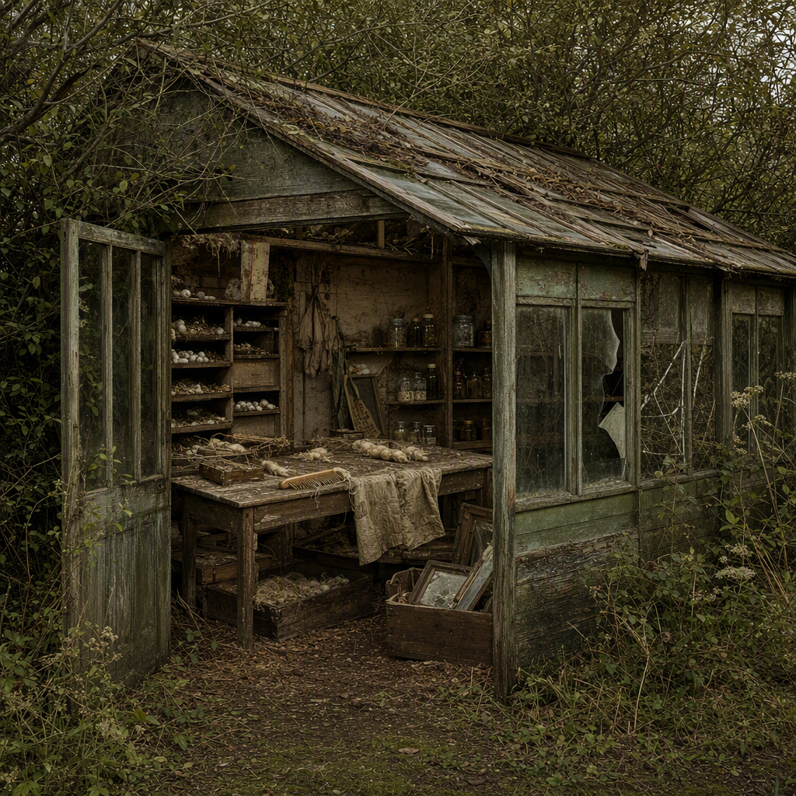

# The Defaulted Silkworm Shed

> Generated from Daybook. Do not edit as source data.

**Canonical ID:** `18fdee5c-1be4-470c-a5b8-ff14167cc39f`  
**Status:** accepted  
**Category:** location  
**World:** Wychcombe (`wyc`)

## Narrative Details

At the edge of the grounds looms a lean-to shrouded in hazel and elder branches. Known as the Silkworm Shed, it had been intended for breeding experiments but fell into rare disuse before its first season&#039;s end. Now, the faint musk of old textiles mingles with the earth of casting-off—unviable seed husks, warped frames, broken glass panels—and words never quite spoken. A warped comb lies on the worktable, the teeth still glossed with stubborn threads that never made their way to loom.

## Record Images

- **Primary:** [image-primary.png](../assets/locations/18fdee5c-1be4-470c-a5b8-ff14167cc39f-the-defaulted-silkworm-shed/image-primary.png)

---
Generated from Daybook
Record ID: 18fdee5c-1be4-470c-a5b8-ff14167cc39f
Last Updated: 2026-09-19T18:04:56.305Z
Snapshot Generated: 2026-09-19T18:04:56.472Z
