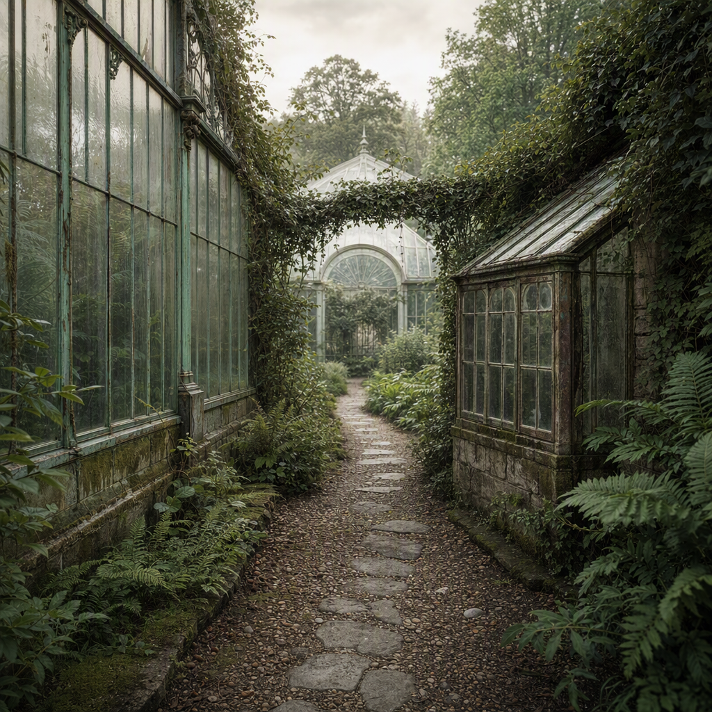

# The Forgotten Path Between Greenhouses

> Generated from Daybook. Do not edit as source data.

**Canonical ID:** `3f3849a2-e143-46c1-b4bd-efafc96739ff`  
**Status:** accepted  
**Category:** location  
**World:** Wychcombe (`wyc`)

## Narrative Details

Connecting the western greenhouse to its minor, older counterpart, a narrow gravel path often vanishes into shadows cast by creeping vines. Though its existence is defined by utility, its presence has become irregular and ritualistic, frequented by those following no formal directions but intimate, remembered routes. This path carries whispers of past gardeners and curators, their faded footprints somehow echoing in the uneven placement of stones polished smooth by countless seasons of falling rain.

## Record Images

- **Primary:** [image-primary.png](../assets/locations/3f3849a2-e143-46c1-b4bd-efafc96739ff-the-forgotten-path-between-greenhouses/image-primary.png)

---
Generated from Daybook
Record ID: 3f3849a2-e143-46c1-b4bd-efafc96739ff
Last Updated: 2026-09-19T19:00:04.890Z
Snapshot Generated: 2026-09-19T19:00:05.067Z
