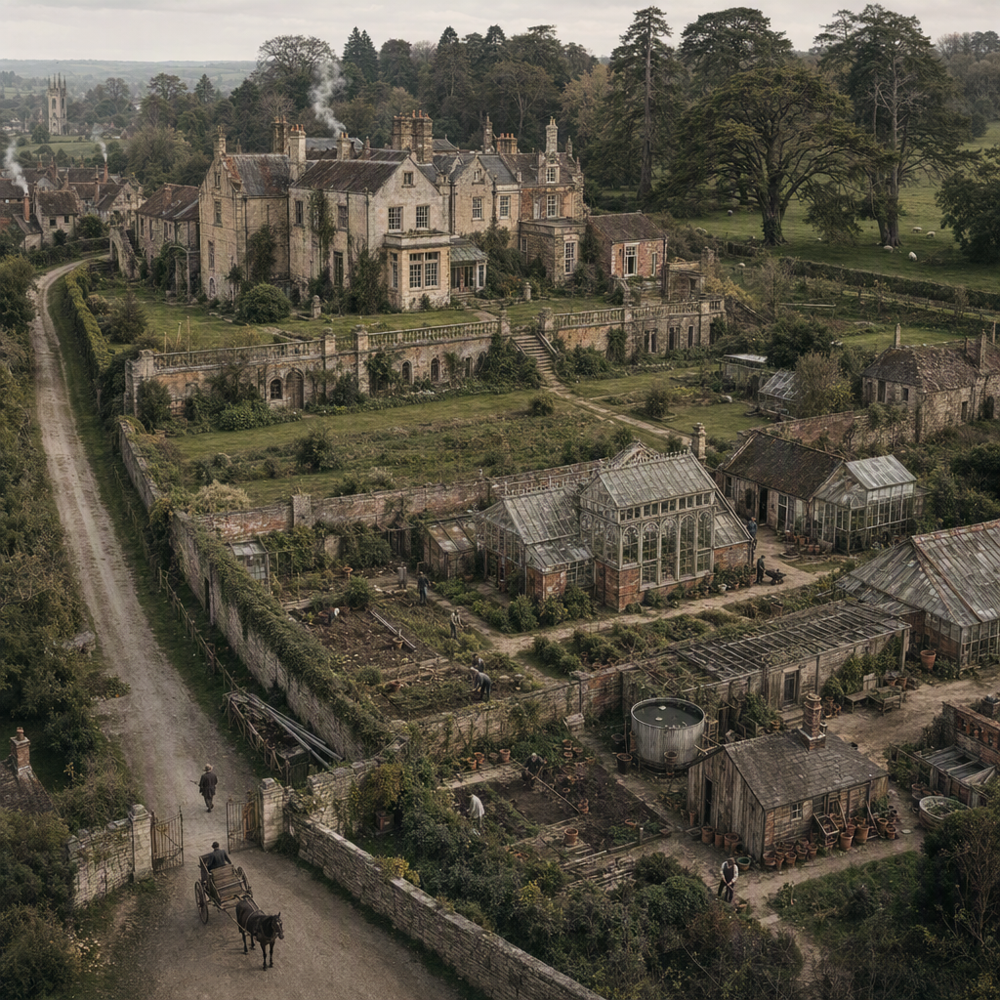

# Wychcombe Estate

> Generated from Daybook. Do not edit as source data.

**Canonical ID:** `ff99a550-0238-4f5b-ace9-c7e0ab4dfe92`  
**Status:** proposed  
**Category:** location  
**World:** Wychcombe (`wyc`)

## Narrative Details

Long before Elias and Clara Ashcroft made Wychcombe a place of deliberate preservation, the estate already possessed a long and complicated life.

The property stood beyond Wychcombe Village, connected to the community by roads and paths used by workers, gardeners, tradespeople, suppliers, and neighboring families. Walls, hedges, gates, and cultivated boundaries marked the transition between village and estate, but the two had never been entirely separate. Generations of villagers had worked on the land, repaired its buildings, supplied its households, cultivated its gardens, and carried away memories that rarely appeared in official records.

At the estate’s center stood a substantial country house assembled across several periods. Its uneven roofline, altered windows, service wings, enclosed passages, and changes in masonry revealed that it had expanded according to the needs and fortunes of successive occupants. It was an important house, but not a palace. Its character came from accumulated use rather than architectural perfection.

Formal terraces and lawns occupied the ground nearest the house. Beyond them lay older trees, walled growing areas, kitchen gardens, orchards, service yards, pasture, and cultivated land. Water, drainage, slope, shelter, and exposure had influenced where things could be built and grown. Generations of gardeners had learned the estate through experience, adapting its grounds rather than imposing a single permanent design upon them.

The estate’s most distinctive feature was its collection of working gardens and glass structures. These had been built, expanded, repaired, heated, reglazed, and replanted over many years. An older brick-based glasshouse stood among later lean-to houses, cold frames, propagation sheds, workrooms, garden walls, and practical paths. Together, they formed a working horticultural landscape rather than a single ornamental conservatory.

By the time Elias Ashcroft arrived to conduct his architectural survey, the property was in decline but had not been abandoned.

Some rooms remained occupied while others had been closed or repurposed. Roof tiles had slipped. Gutters sagged. Paths narrowed beneath moss and self-seeded plants. Glass panes were missing or replaced unevenly. Garden walls leaned where water and roots had disturbed their foundations. Several outbuildings survived only because workers continued making practical repairs with the materials available to them.

Life nevertheless continued throughout the estate. Smoke rose from working chimneys. Carts entered the service yard. Tools, stacked pots, firewood, household laundry, fresh footprints, and recently turned soil showed that the property was still being inhabited and maintained. Thomas Vale and the remaining workers kept selected parts of the gardens productive even as money, staffing, and attention diminished. Some plants were carefully protected. Others were allowed to disappear so that something judged more valuable could survive.

Nothing about the estate was frozen in picturesque decay. It was still being used, negotiated with, repaired, and quietly held together.

Elias initially approached the property as a collection of buildings requiring measurement and professional judgment. He expected plans, deeds, construction methods, and physical evidence to reveal its history. Instead, he found that the estate resisted a single architectural account.

A blocked doorway suggested an earlier passage. Changes in brickwork showed where a glasshouse had been enlarged. Worn thresholds, reused timbers, old hooks, shelves, plant labels, drainage channels, household papers, and repairs made from salvaged materials described generations of daily life absent from the formal record.
Thomas Vale knew which parts of the grounds flooded, which walls retained warmth, which trees predated the surviving plans, and which repairs had been made by workers whose names never entered an account book. Wychcombe Village held still more of the estate’s history in nursery records, tradesmen’s invoices, correspondence, family stories, and memories passed among former workers.

The property Elias encountered was therefore neither an empty ruin awaiting rescue nor a complete estate awaiting a new owner. It was a living accumulation of architecture, labor, cultivation, memory, neglect, and survival.
What eventually became Wychcombe began when Elias and Clara recognized that this accumulated evidence mattered. They did not attempt to return the property to a single imagined moment of perfection. They preserved its layers, restored its usefulness, and allowed new work to stand honestly beside the old.

Wychcombe was not created on untouched ground. It grew from a place that had already been lived in for generations.

## Historical Context

The estate predates Elias and Clara Ashcroft’s establishment of Wychcombe. Its exact age, original name, previous ownership, and earliest architectural history have not yet been established.

By the time Elias arrived as a young architect, the property had already passed through multiple periods of occupation, alteration, prosperity, and decline. The principal house, gardens, glasshouses, service buildings, workers’ spaces, and cultivated land did not originate as a single unified plan. They developed over time in response to changing households, horticultural interests, agricultural use, available money, labor, and practical necessity.
The estate’s relationship with Wychcombe Village also predated the Ashcrofts. Village families supplied workers, gardeners, builders, tradespeople, household staff, plants, materials, and services. This exchange allowed knowledge about the estate to survive outside its official archive.

Thomas Vale worked on the property before Elias arrived and remained through its transition into Wychcombe. His knowledge of its land, gardens, buildings, and earlier working practices made him an important link between the pre-Ashcroft estate and the institution Elias and Clara later developed.

Elias came to the property professionally to assess its buildings and future usefulness. His investigation of the estate’s old glasshouses led him to Bellamy & Son, Nurserymen and Seedsmen, and to Clara Bellamy. Clara’s horticultural knowledge helped demonstrate that the history of the property could not be understood through architecture and ownership records alone.

The estate later adopted the Wychcombe name from the neighboring village. Elias did not name the village, nor did the village originate as a settlement built around the Ashcroft estate.

The precise legal and financial circumstances through which Elias and Clara acquired, leased, inherited responsibility for, or otherwise gained control of the property remain unresolved. Elias should not be portrayed as independently wealthy enough to purchase a major estate casually.

## Visual Notes

Use the approved first-run estate image as the primary visual reference for the Wychcombe Estate.
The estate is viewed from an elevated three-quarter perspective. The principal house occupies the upper middle ground, while its terraces, working gardens, glasshouses, sheds, walled horticultural areas, and service paths descend toward the viewer. This composition allows the estate to be understood as an interconnected working landscape rather than as an isolated house portrait.

The house is constructed primarily from warm, weathered local stone. It has steep gables, tall clustered chimneys, mullioned windows, projecting bays, an irregular roofline, and additions from more than one period. The architecture should suggest an older vernacular or Jacobean core that has been enlarged and altered over generations.

A stone terrace forms the transition between the house and the working gardens. Below it are productive beds, walled enclosures, propagation areas, several differently aged glasshouses, potting sheds, cold frames, water storage, stacked terracotta pots, tools, and service structures.

The gardens show restrained decline. Paths are worn, beds are uneven, masonry is weathered, vegetation has escaped some boundaries, and portions of the glass structures require repair. Nevertheless, workers remain present, soil is being cultivated, plants are being protected, smoke rises from occupied buildings, and carts continue to use the road.

The old estate road follows the boundary wall and passes through a practical gate rather than a monumental ceremonial entrance. Wychcombe Village is visible beyond the estate, with accumulated roofs and a church tower establishing that the village is older, independent, and physically close enough for regular exchange.
Behind the house, mature specimen trees and open pasture demonstrate the larger extent of the property without turning it into an extravagant aristocratic park.

The color palette is muted and natural: weathered limestone, aged brick, moss and lichen, soft greens, dark timber, oxidized metal, old glass, brown earth, terracotta, and a pale overcast sky.

The overall mood is quiet, observant, and historically grounded. The estate is declining but alive—worn enough to require difficult decisions, yet active enough to demonstrate why those decisions matter.

## Canon Notes and Open Questions

The reference image establishes the estate’s overall visual language. It does not automatically establish every visible object, building, path, or geographic feature as canon.

The following remain provisional until named or mapped:
The precise number, age, and purpose of individual glasshouses
The circular water tank and other specific water infrastructure
The exact number and use of service buildings
The detailed route of roads and paths
The precise boundary of the estate
The church or church tower visible near the village
Individual village buildings
The location and extent of pasture, woodland, orchards, and agricultural land
Which structures survive into Margaret Ashcroft’s period
HISTORICAL QUESTIONS TO RESOLVE
What was the property called before it became known as the Wychcombe Estate?
Who owned the property when Elias was commissioned to survey it?
Why was the estate declining?
Who commissioned Elias, and what decision was his survey intended to support?
What was the approximate period of Elias’s arrival?
Through what legal and financial arrangement did Elias and Clara eventually gain control of the property?
Was the property purchased, leased, placed in trust, inherited through an unusual arrangement, acquired through partnership, or transferred through another mechanism?
Which portions of the house and grounds are oldest?
Which major changes occurred before Elias arrived, and which were made by Elias and Clara?
Was the estate historically residential, horticultural, agricultural, experimental, or a combination of these functions?
What event or sequence of events caused its transition from prosperity into decline?
What records survived from the previous owners, and what important information was missing?
What was Thomas Vale’s formal position under the previous owners?
What was Thomas attempting to preserve during the estate’s decline?
What was lost despite his efforts?
What did Thomas deliberately stop maintaining so that more important plants, structures, or systems could survive?
What was Thomas’s relationship with the previous owners and remaining household?

GEOGRAPHIC QUESTIONS TO RESOLVE
How far is the principal house from the center of Wychcombe Village?
Which estate entrance is used for household visitors, workers, deliveries, and access to the horticultural grounds?
Where is Bellamy & Son in relation to the estate and village?
Where will the Stationery House later stand?
Does a church or chapel belong to the established village landscape?
Is there a stream, spring, pond, reservoir, or managed water system on the property?
What is the approximate acreage of the estate?
Which land belongs to the estate, and which surrounding fields belong to village families, tenant farmers, or neighboring landowners?
Are workers’ cottages located within the estate boundary, beside it, or in the village?
Does the estate contain a stable yard, carriage house, dairy, farm buildings, or other agricultural infrastructure?
INSTITUTIONAL QUESTIONS TO RESOLVE
At what point does the property begin to be commonly called the Wychcombe Estate?
When does Wychcombe become more than a private residence and begin functioning as a preservation undertaking?
Which activities remain private family work, and which eventually become accessible to workers, researchers, visitors, or villagers?
How is responsibility for the estate organized under Elias and Clara?
Does the estate ever acquire a formal charter, trust, foundation, or other governance structure?
How does the later Stationery House relate legally and operationally to the estate?
Which parts of the estate become connected to the work of the Curators?

NAMING QUESTIONS
“Wychcombe Estate” is currently the preferred archive name for this canon record. Determine whether this is:
Its formal legal name
The name adopted by Elias and Clara
The common name used by villagers
A later historical label
Or some combination of these
The estate’s pre-Ashcroft name should not be invented casually. It should connect meaningfully to its earlier owners, geography, architecture, or original function.

STORY OPPORTUNITIES — NOT YET CANON
An earlier estate name that survives on deeds, maps, ironwork, stone markers, or old correspondence
Conflicting village and legal accounts of the estate’s history
Missing or incomplete ownership records
A structure absent from the formal plans but remembered by former workers
A garden feature that Thomas Vale insists is older than the house records claim
An old glasshouse repaired so many times that no single construction date adequately describes it
A former owner’s decision that explains both the estate’s decline and the survival of a particular collection
A route between village and estate that was used routinely but never formally recorded
A previous surveyor or owner who misunderstood the property because they ignored working and village knowledge
Documents later preserved at the Stationery House that alter how the estate’s history is understood

CANON GUARDRAILS
Do not describe Elias as the founder of Wychcombe Village.
Do not treat the village as an extension or dependent settlement of the estate.
Do not portray the Ashcrofts as rescuing helpless villagers or bringing history to a place that had none.
Do not make Elias independently wealthy enough to purchase a major estate casually.
Do not portray the property as empty or abandoned when Elias arrives.
Do not make every older feature mysterious, secret, or narratively significant.
Do not introduce supernatural explanations into the estate’s founding history without a deliberate canon decision.
Do not treat the reference image as a literal map.
Do not assign exact dates, structure names, or previous owners solely from generated visual details.
Do not restore the estate into flawless grandeur. Its later identity should retain evidence of age, repair, adaptation, and continuing work.

## Record Images

- **Primary:** [image-primary.png](../assets/locations/ff99a550-0238-4f5b-ace9-c7e0ab4dfe92-wychcombe-estate/image-primary.png)
- **Reference:** [image-reference-01.png](../assets/locations/ff99a550-0238-4f5b-ace9-c7e0ab4dfe92-wychcombe-estate/image-reference-01.png)
- **Reference:** [image-reference-02.png](../assets/locations/ff99a550-0238-4f5b-ace9-c7e0ab4dfe92-wychcombe-estate/image-reference-02.png)

## Related Canon Records

- **owns**: Clara Bellamy Ashcroft (`fd7bc083-fe37-4c83-8a9e-b7ac230b4644`)
- **owns**: Elias Ashcroft (`edb29f8a-af50-49fa-bf8c-9c07dadd4ad6`)

---
Generated from Daybook
Record ID: ff99a550-0238-4f5b-ace9-c7e0ab4dfe92
Last Updated: 2026-09-20T01:28:13.975Z
Snapshot Generated: 2026-09-20T01:28:13.975Z
