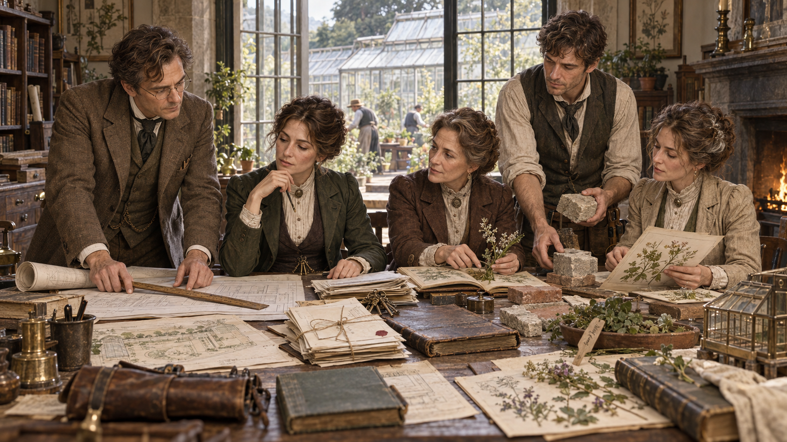

# The Ashcroft Principle of Stewardship

> Generated from Daybook. Do not edit as source data.

**Canonical ID:** `eeb7c737-4491-4f49-ae78-3722ca6a96ae`  
**Status:** accepted  
**Category:** lore  
**World:** Wychcombe (`wyc`)

## Narrative Details

The Ashcroft Principle of Stewardship is the name later given to the philosophy through which Wychcombe distinguishes custody from possession.

Its central statement is simple:

Wychcombe is to be stewarded rather than merely possessed.

The principle did not originate as a formal declaration, legal instrument, or theory written by one person. It emerged gradually through the decline of the Harcourt estate, the collaboration that created Wychcombe, and the practical decisions required to carry the property into another life.

Although the principle bears the Ashcroft name, Elias Ashcroft did not create it alone.

Its foundations include Eleanor Harcourt’s lifetime of memory, Thomas Vale’s knowledge of the estate, Clara Bellamy’s horticultural practice, the Bellamy family’s organization around aptitude, the work of gardeners and tradespeople, the independent history of Wychcombe Village, and Elias’s changing understanding of architecture, inheritance, and authority.

The name should therefore be understood as a later institutional or archival term associated with the founding Ashcroft period—not a declaration of sole authorship.

The Harcourt inheritance

Before Wychcombe, the property belonged to the Harcourt family.

Their estate embodied a conventional relationship among land, family identity, inheritance, labor, and social authority. Ownership passed through family structures intended to preserve continuity. The principal resident and legal heir possessed recognized authority even though much of the knowledge required to maintain the property existed among gardeners, workers, tenants, tradespeople, suppliers, and village families.

As the estate declined, the distinction between ownership and stewardship became increasingly visible.

The distant Harcourt heir held or expected legal control but possessed little personal knowledge of the property. Eleanor Harcourt understood the estate through a lifetime of residence but lacked unrestricted authority over its future. Thomas Vale understood its land, gardens, repairs, and working systems but possessed no ownership claim.

No one form of authority contained the whole truth of the place.

When the absentee heir commissioned Elias Ashcroft to survey the estate, Elias arrived with formal professional authority. He was expected to determine what could be repaired, adapted, divided, sold, salvaged, or demolished.

Eleanor challenged the assumption that the person empowered to make a decision necessarily understood what that decision would destroy.

She did not argue that age made everything valuable or that affection justified preserving the estate intact. She required Elias to investigate before recommending irreversible change.

That requirement became the earliest foundation of the stewardship principle:

Understanding must precede destruction.

Authority and knowledge

Elias’s survey revealed that the estate’s formal records were necessary but incomplete.

Architectural plans recorded intended structures but omitted later adaptations. Family histories preserved owners more readily than workers. Accounts documented expenditure without always explaining purpose. Legal records described property rights but not the knowledge required to sustain the property.

Eleanor’s memories corrected parts of the formal account.

Thomas Vale’s experience revealed how land and structures behaved across seasons.

Bellamy & Son’s correspondence connected the estate to plant orders, cultivation decisions, suppliers, gardeners, and commercial networks.

Clara Bellamy’s observations demonstrated that the history of a glasshouse could not be understood solely through the date of its frame. Its real history included changing cultivation, failed propagation, repaired heating, replaced glass, and the living material generations of gardeners attempted to sustain.

The survey therefore established a second foundation:

Possession does not establish complete authority, and formal status does not establish complete knowledge.

This did not mean that every opinion carried equal weight in every decision.

Stewardship required identifying the form of knowledge relevant to the question.

Elias possessed architectural training.

Clara possessed horticultural and phenological expertise.

Thomas Vale possessed deeply local knowledge of the estate.

Eleanor possessed memory and family history.

Workers and tradespeople understood materials, systems, labor, and repairs.

Village families and businesses preserved economic and social knowledge absent from estate records.

The emerging principle did not replace one dominant authority with another. It required several forms of evidence to remain distinct, attributable, and capable of changing the outcome.

Use and preservation

The Harcourt estate could not be restored to its former scale.

Income had diminished. Buildings had deteriorated. Staff had contracted. Some structures no longer served a viable purpose. Others could survive only through adaptation.

Elias and Clara therefore rejected the idea that preservation meant returning the estate to a single idealized moment.

An old repair could belong to a structure’s history as meaningfully as its original construction. A glasshouse could contain materials from several periods and still remain honest. A room could acquire a new purpose without losing evidence of its earlier use.

The restoration of at least one glasshouse during Eleanor’s lifetime became an early demonstration of this approach.

Sound historic material was retained. Useful later repairs remained. Necessary new work was identifiable as new. The structure was not restored merely to be admired. It returned to cultivation.

This established another principle:

Use is part of preservation.

A building kept empty solely to protect its appearance could become as disconnected from its history as a building carelessly modernized. A record preserved but never consulted could lose practical meaning. A garden maintained only as an imitation of an earlier design could conceal the labor, failure, and adaptation through which it had survived.

Wychcombe would preserve by allowing continued life—not by pretending that change had stopped.

Honest change

Stewardship did not prohibit alteration.

It required change to be informed, necessary, and legible.

New work should not pretend to be old. Loss should not be concealed through invented reconstruction. Later repairs should not automatically be removed merely because they disrupted an imagined original design. At the same time, age alone did not protect a structure, object, or practice from evaluation.

Some things could not be retained.

The responsible response to unavoidable loss was to investigate, document, salvage where appropriate, preserve connected knowledge, and acknowledge what had disappeared.

This became another foundation:

Change should remain honest, and loss should remain visible in the record.

The principle applied to buildings, gardens, collections, archives, working practices, and eventually Wychcombe itself.

Clara and the Bellamy model

The Bellamy family gave the developing principle another essential form.

Edward and Anne Bellamy raised Henry, Clara, and Samuel within a household where responsibility was organized according to knowledge, ability, and need.

Henry developed strength in the commercial operation of Bellamy & Son.

Clara developed expertise in botanical observation, phenology, propagation, and cultivation.

Samuel’s chronic illness limited some physical work but did not diminish his place within the family. Work and routines adapted so that his abilities in reading, correspondence, reference material, organization, and records could contribute.

No one child’s usefulness was measured solely by physical strength, gender, or birth order.

Clara carried this understanding into her marriage with Elias and into Wychcombe.

Her refusal of Elias’s first proposal exposed the contradiction between admiring a person’s expertise and building a life in which that expertise becomes subordinate. Their eventual marriage required shared authority, continued connection to Bellamy & Son, and recognition that Wychcombe would be their undertaking rather than merely Elias’s estate.

This established another element of stewardship:

Authority should follow demonstrated aptitude rather than rank, gender, ownership, or birth order alone.

Distributed responsibility

Stewardship at Wychcombe did not require one person to possess every form of authority.

The principal steward was responsible for protecting the purpose and continuity of the whole. Specialized work remained under the authority of those best prepared to perform and understand it.

An architectural decision could require Elias’s knowledge.

A horticultural decision could require Clara’s.

A question concerning the particular estate might depend upon Thomas Vale.

A commercial decision involving the nursery required Bellamy & Son.

A later building decision might belong to James Ashcroft.

A question of botanical illustration and living collections might require Cecily Ashcroft.

Responsibility for Wychcombe as a whole would eventually belong to Margaret Ashcroft.

These responsibilities could overlap, produce disagreement, and require coordination. Stewardship did not eliminate hierarchy entirely or pretend that every decision could be made by universal consensus.

It required authority to remain accountable to relevant knowledge.

The principal steward could not disregard specialized expertise merely because the law placed the property or institution under that person’s control.

This became a further foundation:

Responsibility for the whole does not confer expertise over every part.

Knowledge and attribution

Wychcombe’s archives developed from many sources.

Estate plans, household accounts, nursery records, workers’ testimony, village memory, architectural observations, botanical registers, correspondence, illustrations, and material evidence all contributed.

The stewardship principle required those sources to remain visible.

Knowledge supplied by a gardener should not become an anonymous “Ashcroft discovery.” A Bellamy record should not lose its commercial and family origins when incorporated into Wychcombe’s archive. Eleanor’s memories should retain her authorship as well as their uncertainty. A village account should not be absorbed into an official estate history that erases the community which preserved it.

This did not mean every surviving claim was accepted as fact.

Stewardship required attribution, comparison, and honest uncertainty.

A memory could be meaningful but incomplete. A formal record could be accurate within its purpose while omitting essential context. A physical repair could contradict both.

The principle therefore required Wychcombe to preserve not only conclusions but, where practical, the evidence and disagreements from which those conclusions emerged.

Knowledge should retain its sources.

Material sustainability

Wychcombe’s founders also understood that preservation required resources.

Buildings needed roofs, drainage, heat, glass, mortar, timber, and labor. Gardens required tools, water, propagation material, and skilled attention. Records required paper, storage, organization, and people capable of maintaining them. Workers and suppliers required payment.

Good intentions could not substitute for material support.

Preserving everything without the means to maintain it would repeat part of the Harcourt failure. Romantic attachment could become another form of neglect if it spread resources so thinly that nothing remained viable.

The principle therefore required prioritization.

Productive land, useful structures, sustainable trade, professional income, Bellamy & Son’s commercial networks, and later Margaret’s interest in publication and the Stationery House all formed part of Wychcombe’s continuity.

Commerce was not automatically opposed to preservation.

It became dangerous when profit erased context, exploited knowledge, or treated the estate as an extractable asset. It became useful when it supported labor, maintenance, education, and continued access to the work.

This established another obligation:

Stewardship must provide for continued care.

The second generation

Elias and Clara raised Margaret, James, and Cecily within the practices from which the principle emerged.

Each child developed a different relationship with Wychcombe.

James became a practical builder closely connected to its physical structures.

Cecily developed expertise in cultivation, botanical preservation, and illustrated plant records.

Margaret increasingly understood Wychcombe as an interconnected institution. She recognized relationships among the estate, the village, Bellamy & Son, the archive, education, commerce, and the work required for long-term continuity.

The succession question forced Elias to confront the remaining inheritance assumptions of his upbringing.

He may initially have imagined that James, as a son and builder working beside him, would succeed naturally to authority over the estate. That expectation would have repeated the system through which Frederick inherited the principal Ashcroft property.

Margaret’s aptitude made the contradiction visible.

She was not selected because she was eldest, because she was a daughter, or because Elias loved her more. She emerged as the person best prepared to hold responsibility for Wychcombe as a whole.

James and Cecily did not become subordinate or rejected figures. Their authority remained meaningful within the areas to which they were particularly suited.

Margaret’s succession became the clearest expression of the principle:

Stewardship should pass to the person prepared to continue the purpose, not automatically to the person placed first by convention.

Succession as responsibility

The principle did not treat Wychcombe as a personal reward.

To become steward was to accept obligations:

To understand before altering

To preserve evidence without freezing the estate

To maintain useful work

To respect specialized authority

To credit knowledge to its sources

To consider the effects of decisions upon workers, village relationships, and living systems

To document irreversible change

To support material continuity

To prepare future stewards

To release authority when another person became better prepared to carry it

A steward could fail.

Possession of the property, family descent, or appointment by a previous steward did not make every later decision consistent with the principle. Wychcombe’s history could therefore include disagreement over whether a steward had fulfilled the responsibilities attached to the role.

The principle was not self-enforcing. Its legal, familial, and institutional mechanisms developed over time and remain to be established.

The Ashcroft name

The term Ashcroft Principle of Stewardship is most plausibly a later name given to a philosophy associated with Elias and Clara’s founding family.

The name is useful but incomplete.

Elias’s life provides the clearest personal arc from inherited hierarchy toward stewardship. Clara and the Bellamy family provide the working model through which responsibility follows aptitude. Eleanor Harcourt establishes the moral requirement to understand before destroying. Thomas Vale and other workers demonstrate that expertise may exist without ownership. Margaret transforms the principle into succession and institutional continuity.

Later Wychcombe generations may retain the familiar name while acknowledging that the principle was formed collaboratively.

Some may question whether calling it “Ashcroft” continues the very habit the principle was intended to resist: assigning collective work to the most socially prominent family.

That question should remain part of Wychcombe’s living interpretation rather than being resolved through a cleaner invented origin.

The continuing principle

The Ashcroft Principle of Stewardship is not a command to preserve Wychcombe unchanged.

It requires each generation to investigate what it has inherited, understand the lives and labor within it, maintain what can remain useful, document what must be lost, and transfer responsibility without confusing love with ownership.

No founder’s interpretation is final.

Elias can be corrected.

Clara’s systems can be revised.

Margaret’s solutions can become inadequate.

Later stewards may discover evidence that changes Wychcombe’s understanding of its own history.

The principle survives not because every generation obeys the founders exactly, but because each generation accepts the obligation to examine its authority honestly.

Wychcombe is to be stewarded rather than merely possessed.

That means it can never belong completely to the person who happens to hold it.

## Historical Context

The Ashcroft Principle of Stewardship emerged during a period when the economic, legal, and social foundations of Britain’s landed estates were under sustained pressure.

For generations, estates like those of the Harcourt and Ashcroft families had connected land, family identity, income, political influence, employment, housing, agriculture, inheritance, and social authority. The estate was not merely a residence. It was a legal and economic structure expected to continue across generations.

That continuity was often protected by concentrating important property within one principal line.

Landed inheritance

Primogeniture was a powerful custom, but it was not a single universal law automatically governing every British family.

Property could pass through:

Wills

Entails

Strict settlements

Trusts

Marriage settlements

Mortgages

Family agreements

Rights of residence

Annuities and other provisions

These arrangements could preserve the main estate for an eldest son while providing money, income, education, or personal property for widows, daughters, and younger sons.

The system sought continuity, but it also concentrated authority.

The expected heir received the property and the responsibility of preserving the family’s public position. Younger children could receive substantial advantages but were generally expected to establish careers, marriages, or households outside the principal estate.

Frederick and Elias Ashcroft represent two different consequences of that structure.

Frederick inherits conventional authority and its obligations.

Elias, as a third son, lacks the principal inheritance but gains greater freedom to enter a profession and construct a life elsewhere.

The stewardship principle develops partly from Elias’s eventual recognition that neither position is inherently just or sufficient. Birth order determines their opportunities before either brother demonstrates aptitude for the role assigned to him.

The burden of continuity

Landed inheritance was intended to preserve estates, but legal continuity did not guarantee economic survival.

Large properties required continuing expenditure upon:

Roofs and masonry

Roads and drainage

Farms and cottages

Domestic and estate staff

Gardens and glasshouses

Heating and water systems

Taxes and legal costs

Family dependents

Mortgages and settlements

Social and local obligations

Wealth tied up in land could produce status without producing sufficient ready money.

The Harcourt decline belongs within the prolonged pressure affecting many landed families during the late nineteenth century. Mining-related income became less dependable, agricultural returns declined, tenant hardship affected rents, debts accumulated, and buildings created during more prosperous periods continued to demand maintenance.

The Harcourt estate demonstrates that ownership alone does not ensure responsible care.

A legal heir may possess authority without knowledge, available capital, personal attachment, or the ability to maintain the inherited property. A resident such as Eleanor may possess knowledge and commitment without final legal power. Workers may possess the expertise required for survival without either ownership or recognized authority.

The Ashcroft Principle emerges from this separation among ownership, knowledge, means, and responsibility.

Widows, settlements, and residence

Eleanor Harcourt’s position reflects the legal and familial arrangements through which widows or other dependents could retain a home without controlling the entire estate.

A marriage settlement, will, trust, jointure, or related arrangement might provide:

A lifetime right of residence

Use of particular rooms or property

An income or annuity

Support from estate funds

Access to household goods

Limited authority over specified assets

Such protection could allow a widow to remain while principal ownership passed elsewhere.

Eleanor therefore occupies a historically credible but difficult position. She knows the estate better than the distant heir, yet her right to live there does not automatically include power to sell, restructure, or determine its future.

Her relationship with Elias exposes a central problem of inherited authority:

The person authorized to decide may not be the person best equipped to understand.

Professional expertise

The nineteenth century saw increasing professionalization across architecture, engineering, law, surveying, medicine, science, and administration.

Formal training and professional identity could provide authority outside inherited rank. Elias’s architectural career belongs to this transition. He possesses expertise because of education and practice rather than because he owns the property he surveys.

Professionalization created new opportunities, particularly for men from privileged families who lacked principal inheritances.

It also created another hierarchy.

A commissioned architect’s written report could receive more weight than the testimony of workers who knew a place intimately. Plans and measurements appeared objective, while memory and working knowledge could be dismissed as informal or anecdotal.

The stewardship principle does not reject professional expertise. It rejects the assumption that one form of professional authority makes other forms of knowledge irrelevant.

Elias’s survey becomes more accurate when it compares:

Architectural evidence

Material alteration

Legal records

Household accounts

Nursery correspondence

Workers’ testimony

Family memory

Garden records

Surviving plants

Landscape behavior

This approach is historically plausible without making Elias a modern social historian or conservation professional.

Preservation and restoration

Victorian Britain possessed a strong interest in historic buildings, antiquities, genealogy, natural history, collecting, and local records.

It also possessed an aggressive culture of restoration.

Architects and patrons sometimes removed later additions, reconstructed missing features, or imposed stylistic unity upon buildings that had accumulated changes across centuries. Such work could preserve a structure while destroying evidence of how it had actually been used and altered.

Other voices increasingly argued that age, repair, wear, and accumulated change had historical value. They questioned whether restoration should manufacture an idealized past.

The Ashcroft Principle belongs within this debate.

It favors:

Understanding before intervention

Retaining sound historic material

Respecting useful later alterations

Making necessary new work identifiable

Recording unavoidable loss

Preserving continued use where possible

It does not prohibit repair, reconstruction, adaptation, or new construction.

This distinguishes stewardship from both neglect and rigid antiquarianism.

A deteriorating glasshouse cannot be preserved merely by admiring its old iron. It must be made capable of sheltering cultivation—or its loss must be documented honestly.

The Arts and Crafts context

The principle also develops alongside ideas later associated with the Arts and Crafts movement.

Those ideas include respect for:

Skilled labor

Honest materials

Useful design

Visible workmanship

The relationship between beauty and function

The social conditions under which objects and buildings are made

Elias’s architectural interests align with these developing concerns, but the Ashcroft Principle should not be presented as an official Arts and Crafts doctrine.

Its sources are more local and practical.

Eleanor asks what will be lost.

Thomas Vale explains how the estate actually works.

Clara demonstrates how living systems respond over time.

Workers reveal adaptations absent from plans.

The Bellamys show that useful commerce and serious knowledge can coexist.

The principle grows through practice before later generations give it a formal name.

Commercial knowledge and the Bellamys

The rise of prosperous commercial and professional families complicated the old distinction between landed status and practical authority.

Bellamy & Son possesses no noble title, but it holds:

Horticultural expertise

Business connections

Customer relationships

Records

Transport knowledge

Credit relationships

Regional reputation

Access to wider markets and suppliers

The Bellamys move between village customers, farmers, professional gardeners, merchants, and country estates.

Their authority is earned through competence and reliability rather than inherited land.

The family’s internal organization also challenges conventional inheritance assumptions.

Henry’s commercial ability, Clara’s horticultural expertise, and Samuel’s strengths in correspondence and records are treated as different contributions to the same family enterprise. Samuel’s chronic illness limits some work but does not remove his value or place within the household.

The Bellamy model does not eliminate hierarchy. Edward, Anne, and eventually Henry retain recognizable family and business authority. Its importance lies in the willingness to adapt responsibility according to actual ability.

This becomes one of the strongest practical foundations of Wychcombe’s stewardship principle.

Women, marriage, and authority

Clara’s contribution must be understood within the legal and social position of late Victorian women.

Women participated extensively in family farms, shops, nurseries, workshops, offices, and commercial enterprises. Their work could be essential while remaining absent from business names, formal titles, and public recognition.

Marriage traditionally restricted a woman’s independent legal and financial identity. Reforms during the nineteenth century expanded married women’s ability to own property and retain earnings, but legal change did not automatically transform social expectations.

A married woman’s expertise could still be treated as an extension of her husband’s work. Her money might support property publicly associated with him. Her professional relationships could be reclassified as domestic interests.

Clara’s refusal of Elias’s first proposal is therefore historically significant.

She insists that marriage must not erase:

Her work

Her professional identity

Her family connections

Her authority

Her relationship with Bellamy & Son

Their eventual partnership gives the stewardship principle another dimension:

Authority cannot be considered responsible if it depends upon the disappearance of another person’s contribution.

This does not make their marriage fully modern or free from unequal pressures. It makes equality an explicit and continuing practice rather than an automatic condition.

Labor and unrecorded knowledge

Landed estates depended upon people whose knowledge rarely appeared in formal histories.

These included:

Gardeners

Farm workers

domestic servants

Carpenters

Masons

Glaziers

Plumbers

Boiler and heating specialists

Carters

Nurserymen

Tenants

Suppliers

Clerks

Local tradespeople

Their work altered buildings, maintained systems, preserved plants, moved materials, and adapted the estate to recurring problems.

The stewardship principle recognizes that such knowledge is historically significant.

This recognition should not be overstated into modern labor equality. Elias and Clara still occupy positions of privilege and authority. Workers do not automatically receive equal control of the estate.

The principle is historically meaningful because it requires their knowledge to affect decisions, retain attribution, and become part of the record.

Its limitations should remain visible.

Later generations may reasonably question whether the founders listened enough, credited accurately, paid fairly, or shared authority as fully as their stated philosophy implied.

Village and estate

Traditional estate histories often treat the neighboring village as an extension of the great house.

Wychcombe reverses that direction in an important way.

Wychcombe Village predates the Ashcroft institution. The estate adopts the community’s name rather than bestowing one upon it. Bellamy & Son, village businesses, workers, families, and local institutions possess histories independent of the Harcourts and Ashcrofts.

The stewardship principle therefore cannot treat village knowledge as estate property.

The relationship between village and estate includes:

Employment

Trade

Supply

Credit

Memory

Family connections

Resentment

Cooperation

Unequal power

Shared dependence

Stewardship requires the estate to recognize these relationships without claiming to govern the village’s identity.

Trusts, settlements, and institutional continuity

The phrase “stewarded rather than possessed” is philosophical before it becomes legal.

Victorian property law offered several mechanisms through which land, income, residence, and future control might be structured. Wills, settlements, trusts, leases, and appointed trustees could separate beneficial use from some aspects of legal control.

The exact mechanism used at Wychcombe remains unresolved.

Historical plausibility requires distinguishing among:

Personal ownership

Family settlement

Trust property

Life tenancy

Institutional authority

Business assets

Rights of residence

Duties imposed by a will

Informal family expectations

The principle should not be described through modern nonprofit governance unless those structures develop later.

Elias and Clara can establish a strong philosophy before they solve every legal question. Margaret or later generations may formalize practices that begin as family agreements and working custom.

Margaret’s succession

Margaret’s succession represents a deliberate departure from the inheritance culture in which Elias was raised.

The decision is historically unusual enough to matter but not impossible.

Women could inherit and control property, particularly when wills, settlements, trusts, or the absence of restrictive arrangements allowed it. The central obstacle is therefore not that a daughter could never receive Wychcombe. It is that landed-family convention strongly encouraged authority to follow the principal male line.

Margaret is not selected merely as an exception made for an exceptional daughter.

She is selected because Wychcombe rejects automatic succession as its governing rule.

James possesses valuable authority concerning buildings and practical work.

Cecily possesses valuable authority concerning living collections and botanical records.

Margaret is best prepared to hold responsibility for the relationships among all of Wychcombe’s parts.

The distinction between specialized authority and responsibility for the whole is essential to the principle.

Financial sustainability

The Harcourt decline demonstrates that preservation without sustainable resources can become prolonged deterioration.

Wychcombe requires income to support:

Wages

Repairs

Heat

Glass

Tools

Records

Storage

Productive land

Gardens

Education

Supplies

Future work

The stewardship principle therefore includes commerce and financial planning.

This is strongly influenced by the Bellamys, for whom knowledge, useful goods, and trade are not inherently opposed.

Margaret later extends this understanding through publishing, education, participation, and the Stationery House.

Commercial activity remains subject to ethical limits. Wychcombe should not exploit the village, sell restricted knowledge, disguise reproductions as originals, or reduce its history to fashionable merchandise.

The historical significance lies in refusing the idea that moral preservation must remain financially innocent and therefore economically impossible.

Stewardship as a later institutional term

The complete phrase The Ashcroft Principle of Stewardship may not originate during the founding years.

It may be formalized later through:

Margaret’s administration

A will or family agreement

A later archivist’s terminology

The Curators

An institutional history

A legal restructuring of Wychcombe

Debate during a later succession

This later naming is historically useful because principles often acquire clear titles only after practices have existed for years.

The name also contains a tension.

Calling the philosophy “Ashcroft” emphasizes the family through which Wychcombe developed. It may also obscure the contributions of Eleanor Harcourt, Clara and the Bellamys, Thomas Vale, workers, tradespeople, and Wychcombe Village.

Later generations may retain the established term while acknowledging that its authorship was collective.

That debate belongs within the principle’s history rather than threatening it.

Historical character of the principle

The Ashcroft Principle should not be presented as a fully democratic, egalitarian, or modern governance system.

It emerges from a society still shaped by:

Class hierarchy

Unequal property rights

Gender restrictions

Limited political participation

Deference to professional and landed authority

Economic dependence

Informal labor knowledge

Unequal access to records and education

Its importance lies in challenging some assumptions from within that world.

It asks whether legal ownership is sufficient.

It recognizes that expertise may exist outside rank.

It assigns responsibility according to aptitude.

It treats use and adaptation as part of preservation.

It requires knowledge to retain its sources.

It expects authority to prepare for its own succession.

The principle remains imperfect because the people who develop it remain people of their period.

Its continued value depends upon later generations being permitted to examine those limitations rather than treating the founders’ language as sacred.

Core historical principle

The Ashcroft Principle of Stewardship emerges when an inherited estate can no longer be sustained through inheritance alone.

It replaces the promise that property will endure because it remains within one family line with a more demanding proposition:

A place endures only when authority is joined to knowledge, responsibility, continued use, material support, and the willingness to entrust its future to someone capable of carrying the work forward.

## Visual Notes

The Ashcroft Principle of Stewardship should be represented through shared work, transferred responsibility, and evidence of continued use.

It should not be visualized as a family crest, ceremonial inheritance, legal proclamation, or heroic portrait of Elias Ashcroft.

The principle is most legible when several people possess different forms of authority within the same scene.

Primary canon image

The preferred canon image should depict a later-life working meeting at Wychcombe during the transition toward Margaret’s stewardship.

The scene takes place around a large, worn worktable in a Wychcombe library, estate office, archive room, or connected working space. The room contains evidence of several generations and several forms of knowledge without appearing cluttered for decorative effect.

Margaret occupies the practical center of the composition.

She is not seated upon a ceremonial chair or receiving an inheritance formally. She is reviewing a decision concerning Wychcombe as a whole. Her position communicates responsibility rather than rank.

Around or near her:

Elias is present but no longer directing every part of the discussion.

Clara has botanical or seasonal records before her.

James has plans, material samples, measurements, or repair estimates.

Cecily has botanical illustrations, specimen records, or greenhouse notes.

The Ashcroft Ledger lies open or closed within reach but does not dominate the table.

Bellamy & Son correspondence or catalogs may be present as a distinct source.

An older Harcourt plan or garden book may remain visible beneath later working material.

A practical object associated with Thomas Vale—such as a weathered label, terse working note, or familiar tool—may connect the scene to knowledge predating the Ashcrofts.

Margaret listens while another person contributes expertise.

The key visual fact is that she holds responsibility for the whole without pretending to possess every answer.

Elias’s posture should communicate deliberate withdrawal from automatic authority. He may sit slightly away from the head of the table, stand beside rather than behind Margaret, or place a document within her reach and allow her to decide what happens next.

Clara should appear as an active founder and senior authority, not as a proud mother observing her husband and daughter.

James and Cecily should retain visible professional agency. They are not disappointed siblings attending Margaret’s elevation. Each is contributing knowledge required by the decision.

The image should feel like stewardship already in practice rather than a symbolic handover arranged for posterity.

Alternative primary composition

A second strong option is a multigenerational worktable shown without figures.

The table contains several distinct but connected working areas:

Elias’s architectural plan and measuring rule

Clara’s botanical register and specimen

James’s material sample and construction notes

Cecily’s illustrated botanical page

Margaret’s correspondence, proof sheets, or organizational plan

An Eleanor Harcourt garden book

A Thomas Vale working label or weather note

Bellamy & Son correspondence

The Ashcroft Ledger

A ring of practical estate keys placed near Margaret’s materials rather than centered ceremonially

No single object should appear to own the table.

Threads of use, annotation, wear, and cross-reference visually connect the materials. This approach can represent the principle without reducing it to one person’s portrait.

Emotional register

The atmosphere should be:

Deliberate

Collaborative

Quietly consequential

Practical

Historically layered

Hopeful without becoming triumphant

Serious without becoming solemn ceremony

Warm through use rather than sentimentality

The image should communicate that an important decision is occurring within ordinary work.

Avoid coronation-like composition, dramatic beams of light, tearful family pride, or everyone gazing reverently at Margaret.

Composition

The composition should avoid a rigid hierarchy.

Useful arrangements include:

A broad table with people positioned along more than one side

Margaret slightly central but not visually elevated

Elias offset from the traditional head position

Clara, James, and Cecily each connected to their working materials

Open space allowing the viewer to see relationships among objects

A doorway or window connecting the interior discussion to the active estate outside

Workers, gardeners, or village activity visible at a respectful distance where appropriate

The visual hierarchy should arise through attention.

People look toward the evidence, the person speaking, or the work under discussion rather than toward a ceremonial center.

Setting

Appropriate settings include:

Wychcombe’s working library

An estate office

The archive room

A room adjoining the restored glasshouse

A shared planning room containing architectural, botanical, and commercial records

A maintained but visibly adapted Harcourt room now serving a new purpose

A worktable positioned where the house and gardens can both be seen

The setting should contain historical layers:

Harcourt furniture still in useful service

An older wall finish or architectural feature

Ashcroft-era shelving or work surfaces

Bellamy records

Later repairs visible without imitation

A view toward an actively used garden or glasshouse

The room should not resemble a modern boardroom.

Architecture and materials

The visual language should include:

Local stone

Granite

Dark or weathered wood

Slate

Old glass

Ironwork

Lime plaster

Aged paper

Worn leather

Brass

Linen

Twine

Terracotta

Graphite

Iron gall ink

Practical repairs

Surfaces polished through repeated use

Newer work should be visibly compatible without pretending to be original.

A repaired shelf, replaced section of floor, altered doorway, or reused table may quietly express the principle through material evidence.

The role of the Ashcroft Ledger

The Ledger may appear, but it should not function as a sacred book, legal scripture, or sole source of authority.

Appropriate uses include:

Lying among several records

Open to a consulted page while other evidence remains present

Being handed to Margaret without ceremonial display

Showing wear from continued use

Accompanied by Clara’s registers, Cecily’s journals, village papers, or Bellamy correspondence

Avoid:

A glowing Ledger

Everyone gathered around it reverently

A key, seal, or beam of light making it appear mystical

Visible missing pages used as an ominous clue

Treating it as the complete statement of the principle

The Ledger represents one founder’s developing understanding, not the principle’s entire authority.

Keys and symbols of access

Keys can be used sparingly.

A ring of estate keys may symbolize practical access and responsibility, but it should not become a crown substitute. The keys should look used, mismatched, labeled, and connected to actual doors, stores, glasshouses, or record rooms.

The most appropriate image shows keys placed among working materials or used to open a space—not held aloft during a formal transfer.

The Seven Keys should not automatically be inserted into the principle’s imagery unless their specific relationship is later established.

Margaret’s visual role

Margaret should appear capable of holding the whole without becoming visually dominant over every specialist.

She may:

Compare several records

Ask James about a repair

Consult Clara about cultivation

Review Cecily’s documentation

Consider Elias’s historical note

Draft a decision after hearing the others

Connect work at the estate with the Stationery House or village

Place different pieces of evidence into relationship

Her authority appears through synthesis, responsibility, and attention.

Avoid depicting Margaret merely receiving documents from Elias while everyone else watches. That would turn stewardship back into a single-line inheritance.

Elias’s visual role

Elias should appear as a founder learning to become a predecessor.

Appropriate gestures include:

Moving a plan toward Margaret

Listening while she asks another person for expertise

Sitting away from the head of the table

Closing his notebook rather than delivering the final conclusion

Offering the Ledger without requiring obedience to it

Watching the working system continue without controlling every exchange

He should remain engaged. Stewardship does not require disappearing theatrically once a successor is identified.

Avoid making Elias the central patriarch blessing Margaret’s appointment.

Clara’s visual role

Clara should appear as a co-founder and continuing authority.

Her presence may include:

Botanical registers

Seasonal observations

Nursery correspondence

Specimens or labels

A question concerning the living consequences of an architectural decision

An exchange with Margaret independent of Elias

Collaboration with Cecily

Reference to Bellamy & Son’s records or commercial knowledge

Clara should not stand behind Elias, place a maternal hand on Margaret’s shoulder, or function only as emotional support.

Her work is one of the structures from which the principle emerged.

James’s visual role

James should be depicted as a respected specialist rather than the son who lost an inheritance.

Appropriate objects include:

A measured drawing

Timber or masonry samples

A repair estimate

A practical model

A folding rule

A section detail

A worn tool

Notes made at an active worksite

His contribution should influence the decision before the group.

Avoid:

Defensive posture

Visible resentment unless tied to a developed scene

Standing outside the family circle

Empty hands while Margaret holds all records

Symbolic displacement by a sister elevated above him

Cecily’s visual role

Cecily should appear as a practitioner whose botanical and visual records preserve evidence other sources cannot.

Appropriate materials include:

Illustrated botanical journals

Specimen studies

Greenhouse records

Cultivation notes

Plant labels

Drawings showing change over time

Evidence of disease, damage, dormancy, or propagation—not only flowers

Her illustrations should be treated as working documentation rather than decorative art placed beside serious records.

Eleanor Harcourt’s continuing presence

Eleanor may be represented through objects or records after her death:

A garden book

A corrected estate plan

A familiar chair still in use

A handwritten note

A household key

A labeled bundle of testimony

An older object integrated into ongoing work

Her presence should communicate continuity without turning the room into a memorial shrine.

If Eleanor appears in a founding-period image of the principle, she should participate actively by correcting, explaining, or reviewing—not simply witness Elias developing an idea.

Thomas Vale’s continuing presence

Thomas should be represented through practical evidence rather than a symbolic gardening prop.

Appropriate elements include:

A terse working note

Weather marks

A reused plant label

A maintenance annotation

A tool with long use

A corrected planting or drainage diagram

Thomas himself pointing to physical evidence during an earlier scene

Avoid reducing him to a spade leaning decoratively against a wall.

Bellamy & Son

Bellamy & Son should appear as an independent source of knowledge and material, not a department of Wychcombe.

Visual indicators may include:

Distinct nursery correspondence

Catalogs

Seed packets

Order books

Crates or labels

Invoices

Propagation records

A recognizable but restrained nursery mark

These materials should remain visually separate enough to retain their origin.

Wychcombe Village

The principle should not be illustrated entirely inside an Ashcroft family room.

Where appropriate, include visible connections to the village:

A notice awaiting printing

A supplier’s invoice

A villager consulting a record

A tradesperson reviewing plans

Materials delivered through a local business

A path or view toward the village

Stationery House proofs

Correspondence requiring an answer

A worker contributing information at the table

Avoid representing “the village” through one picturesque laborer placed in the background.

Working stewardship scenes

The principle may also be depicted through several specific moments:

Eleanor correcting the survey

Legal authority, professional authority, and lived knowledge meet across an estate plan.

The glasshouse restoration

Old material, later repair, and identifiable new work allow cultivation to continue.

Clara refusing the first proposal

Shared life cannot be built through the disappearance of one person’s work.

A village or worker consultation

Knowledge changes the decision rather than merely decorating it.

Margaret coordinating specialized authority

Responsibility for the whole does not erase expertise within each part.

Elias entrusting the Ledger

A founder offers evidence and responsibility without demanding imitation.

Later correction of a founder’s conclusion

New evidence revises the record without treating revision as disloyalty.

These scenes can become a visual sequence demonstrating that stewardship is practiced repeatedly rather than declared once.

Color palette

The palette should combine the established Wychcombe materials:

Warm ivory

Aged paper

Dark walnut

Muted olive

Moss

Charcoal

Soft grey

Oxblood or faded burgundy leather

Tarnished brass

Terracotta

Dusty blue

Muted berry

Weathered stone

Old glass

Restrained natural green

Colors should feel accumulated through use rather than coordinated as a ceremonial family palette.

Lighting

Use natural, working light:

Soft Cornish daylight through tall windows

Glasshouse light filtered through old panes

Restrained lamplight

Modest firelight

Light falling across several sources rather than illuminating one chosen person

Avoid divine-looking light upon Margaret, Elias, the Ledger, or the keys.

Avoid

A family crest as the primary image

Heraldry, crowns, coronets, or ceremonial seals

Elias posed alone as the author of the principle

Margaret enthroned or elevated above her siblings

A formal reading of a will as the sole representation

A key presented like a royal scepter

A glowing Ledger or mystical archive

Modern boardroom composition

Contemporary governance imagery

Everyone voting by raised hands

A handshake used as the entire visual story

Workers and villagers reduced to a grateful audience

Clara standing supportively behind Elias

James depicted as a rejected heir

Cecily’s records treated as decoration

Bellamy & Son visually absorbed into Wychcombe

Perfect symmetry suggesting fixed hierarchy

An immaculate restored estate

Pristine records untouched by use

New work disguised as ancient fabric

Gothic mystery, supernatural symbolism, or secret-society imagery

Readable generated text on legal documents, ledgers, labels, or plans

Depicting stewardship as passive guardianship rather than active responsibility

Core visual principle

The Ashcroft Principle of Stewardship should look like authority moving toward the person best prepared to carry responsibility—while knowledge, work, and memory remain visibly distributed among many hands.

## Canon Notes and Open Questions

Current status

The Ashcroft Principle of Stewardship remains Proposed until its legal form, naming history, and relationship to later Wychcombe governance are clarified.

Its philosophical direction is established strongly enough to guide related character and location records.

Do not treat every proposed implementation mechanism as confirmed canon.

Preserve the distinction between:

The principle

The practices through which it first develops

The legal arrangement used for Margaret’s succession

Later institutional governance

Interpretations adopted by the Curators

Confirmed direction

The principle rests upon these established ideas:

Wychcombe is to be stewarded rather than merely possessed.

Ownership does not establish complete knowledge or unlimited moral authority.

Understanding should precede irreversible alteration or destruction.

Preservation includes adaptation, use, honest repair, and documented loss.

Authority should follow demonstrated aptitude rather than birth order, gender, title, or ownership alone.

Responsibility for the whole does not create expertise over every part.

Knowledge should remain attributable to its sources.

Stewardship requires financial and material sustainability.

A steward must prepare for eventual succession.

Founders and earlier stewards remain open to correction.

Margaret becomes Wychcombe’s principal steward because she is best prepared to hold responsibility for the whole.

James and Cecily retain meaningful authority within their own areas of contribution.

Clara and the Bellamy family are foundational sources of the principle.

Eleanor Harcourt, Thomas Vale, workers, tradespeople, and Wychcombe Village materially influence its development.

Elias does not create the principle alone.

Naming history requiring definition

Determine when the phrase The Ashcroft Principle of Stewardship first appears.

Elias should not name the principle after himself.

The most plausible possibilities are:

Margaret gives the existing practice a name while organizing Wychcombe.

A later archivist or historian uses the term retrospectively.

The Curators formalize the phrase.

A legal or institutional document adopts it after a period of informal use.

Outside observers begin using the term and Wychcombe later accepts it.

Determine whether “Ashcroft” refers specifically to Elias and Clara, the founding Ashcroft generation, or the family period more broadly.

Establish whether later members of Wychcombe criticize the name for obscuring non-Ashcroft contributions.

Do not solve that criticism by renaming the record immediately. The contested name may become part of its meaning.

Consider whether Wychcombe uses a shorter internal phrase such as:

“the stewardship principle”

“stewardship”

“the Wychcombe obligation”

These alternatives should not become canon until the naming history is defined.

Legal structure requiring definition

Determine how the principle is translated into enforceable authority.

Do not assume that philosophical stewardship automatically limits legal ownership.

Possible mechanisms include:

A will

A family settlement

A trust

Appointed trustees

A life tenancy

A lease with defined duties

A deed containing restrictions or covenants

A business or institutional structure

A combination developed across generations

Determine whether Elias and Clara create the initial legal structure or whether Margaret formalizes it.

Establish whether property, collections, records, businesses, and intellectual materials are governed through the same mechanism.

They may require different arrangements.

Do not use modern nonprofit, corporate, or fiduciary language until the relevant later period supports it.

Seek historical review before fixing technical legal terminology.

Margaret’s succession

Determine whether Margaret receives:

Legal ownership

Trusteeship

Administrative authority

Beneficial use

Responsibility under a will

Authority shared with other trustees

A combination of these

Establish whether Elias initially creates a conventional succession plan naming James.

Determine whether that earlier document survives.

Clarify when Clara recognizes Margaret’s suitability and how she participates in the decision.

Determine when Elias recognizes the contradiction in his earlier assumptions.

Establish whether Margaret accepts immediately or hesitates.

Define what preparation she receives before the transfer.

Clarify whether authority shifts gradually during Elias’s lifetime.

Determine whether Margaret can be removed or replaced if she fails in the role.

Avoid making stewardship dependent entirely upon the founder’s personal judgment.

James and Cecily

Establish the authority James retains over buildings, materials, repairs, or construction.

Establish the authority Cecily retains over living collections, cultivation, preservation, and botanical documentation.

Determine whether their roles are formalized or remain family practice.

Clarify how disagreements between specialized authority and the principal steward are resolved.

Do not make Margaret’s coordinating responsibility automatically override supported specialist judgment.

Determine whether James and Cecily explicitly support Margaret’s succession.

Allow mixed feelings without turning either sibling into an antagonist.

Establish whether their descendants retain any rights, duties, or expectations.

Clara’s role

Clara’s foundational influence is confirmed and should no longer be listed as an open question.

The remaining question concerns the form of her participation:

Does she propose the principle explicitly?

Does she identify Margaret as the appropriate steward?

Does she help draft the practical arrangement?

Does she insist upon distributed authority?

Does she serve as trustee or co-holder of property?

Avoid reducing Clara’s role to private persuasion of Elias.

The principle should emerge visibly through their marriage, household, parenting, and shared operation of Wychcombe.

Determine whether Clara’s independent financial contribution affects her legal authority.

Relationship to Eleanor Harcourt

Eleanor’s role should be acknowledged as foundational rather than honorary.

Her insistence upon understanding before destruction becomes one of the principle’s earliest moral commitments.

Determine whether Elias or Margaret explicitly records this connection.

Establish whether Eleanor leaves instructions, testimony, papers, or property relevant to later stewardship.

Do not retroactively make Eleanor a formal co-author of a principle named after her death unless the record supports that language.

Her influence may be practical and remembered rather than formally documented.

Relationship to Thomas Vale and workers

Determine how knowledge from Thomas Vale and other workers is credited in Wychcombe records.

Establish whether contributors can correct Elias’s or Margaret’s summaries.

Clarify whether oral testimony is preserved directly, paraphrased, or recorded through later interviews.

Determine whether workers receive compensation for extended specialist consultation.

Do not claim the principle democratizes Wychcombe completely.

Employment, class, gender, and property inequalities remain.

Later generations may criticize a gap between the principle’s language and its actual treatment of workers.

Such criticism should be possible without invalidating the principle’s historical significance.

Relationship to Wychcombe Village

Define the practical obligations Wychcombe owes the village.

Possible areas include:

Fair payment

Local purchasing

Employment practices

Access to selected records

Education

Consultation on shared history

Responsible land and water management

Preservation of village contributions

Do not give the estate authority over village governance.

Do not treat the village as a stakeholder group using modern terminology during the founding period.

Determine whether village representatives ever participate formally in later Wychcombe decisions.

Preserve the village’s independent history and capacity to disagree with the estate.

Financial sustainability

Define what commercial activity the principle permits or encourages.

Establish ethical boundaries around:

Publication

Visitors

Education

Plant sales

Reproductions

Licensing

Estate products

Use of village knowledge

Sale or lease of land

Determine whether Wychcombe may dispose of objects or property to protect the larger institution.

Avoid a rule that nothing can ever be sold.

Establish who decides when sale, adaptation, or removal is necessary.

Require documentation of significant irreversible decisions.

Determine whether financial emergency can temporarily override ordinary practice.

Clarify what accountability follows such an exception.

Do not romanticize insolvency as moral purity.

Access and privacy

Stewardship does not require universal public access to every record, object, room, or collection.

Define categories of restricted material.

Possible restrictions may concern:

Personal correspondence

Medical information

Family privacy

Commercially sensitive nursery records

Fragile materials

Dangerous locations

Unverified allegations

Living people

Determine who authorizes access and review.

Avoid allowing “preservation” to become a permanent excuse for secrecy.

Avoid allowing “public history” to erase legitimate privacy.

The later Curators may develop access rules from this tension.

Failure and accountability

The principle requires examples of possible failure.

A steward may fail by:

Treating Wychcombe as personal property

Ignoring relevant expertise

Concealing loss

Refusing necessary change

Spending beyond sustainable means

Exploiting workers or village knowledge

Allowing records to deteriorate

Restricting access for personal convenience

Selling significant material without documentation

Treating a founder’s interpretation as final

Refusing to prepare a successor

Preserving appearance while allowing useful systems to collapse

Determine what happens when a steward fails.

Possible responses include:

Family intervention

Trustee review

Specialist objection

Written dissent in the archive

Legal restriction

Removal from a role

Transfer of responsibility

Public or village pressure

Institutional reform

Do not make the principle self-enforcing through moral authority alone.

Emergency decisions

Define how stewardship operates during fire, flood, structural collapse, disease, war, financial crisis, or another emergency.

Immediate action may be necessary before full consultation.

Establish who may act and what later documentation is required.

Allow triage. Stewardship cannot promise that everything will be saved.

Determine how priority is assigned among:

Human safety

Living collections

Buildings

Records

Objects

Productive capacity

Avoid creating one permanent ranking that applies to every emergency.

Relationship to the Curators

The later relationship between the principle and the Curators remains unresolved.

Determine whether the Curators:

Emerge to protect the principle

Interpret it

Enforce access and preservation rules

Manage collections

Advise the principal steward

Become trustees

Develop independently and later claim the principle

Do not assume the Curators always represent stewardship correctly.

They may become overly protective, secretive, bureaucratic, or resistant to necessary change.

Later story tension may arise when preservation becomes control.

Determine whether the Curators can challenge the steward.

Determine whether the steward can overrule the Curators.

Clarify whether the Curators serve Wychcombe, the archive, the family, or a broader public purpose.

Evolution across generations

The principle should change in interpretation without losing its central obligations.

Later generations may expand it to address:

Public access

Education

Conservation science

Environmental responsibility

Employment standards

Intellectual property

Digital records

Repatriation or contested provenance

Accessibility

Do not insert these modern applications into the Victorian founding language.

Each generation should translate the principle into the problems of its own period.

Preserve earlier limitations in the record rather than rewriting the founders as if they already held later values.

Evidence and documentation

Determine where the principle is recorded.

It may exist across several sources rather than one definitive document:

Elias’s Ledger

Clara’s records

Wills or settlements

Margaret’s administrative papers

Stationery House publications

Curator manuals

Later institutional histories

Avoid creating one perfectly complete founding manifesto unless later required.

Differences among documents may reveal how the principle evolves.

Establish which statement contains the phrase “stewarded rather than merely possessed.”

Determine whether that wording belongs to Elias, Clara, Margaret, or a later interpreter.

Until decided, treat the sentence as the authoritative expression of the principle without assigning authorship inside the story.

Canon guardrails

Do not credit Elias as sole author.

Do not reduce the principle to Margaret inheriting instead of James.

Do not treat stewardship as ceremonial benevolence.

Do not equate legal ownership with moral or intellectual authority.

Do not make every decision democratic.

Do not erase the need for a person or body to hold final responsibility.

Do not treat all knowledge claims as equally reliable.

Do not use stewardship to justify indefinite secrecy.

Do not make preservation automatically more important than safety, labor, or sustainability.

Do not make commerce automatically corrupt.

Do not make the principle fully modern in its founding form.

Do not imply that the founders consistently fulfill their own ideals.

Do not make later correction an act of betrayal.

Do not turn the principle into mystical law, family prophecy, or secret oath.

Do not connect it automatically to the Seven Keys, missing Ledger pages, or another mystery without developed evidence.

Possible later conflicts—not yet canon

A steward invokes preservation to resist a necessary adaptation.

The Curators conceal a record in the name of institutional protection.

A village family challenges Wychcombe’s claim to material or knowledge originating outside the estate.

James’s descendants dispute the meaning of Margaret’s succession.

A commercial project supports Wychcombe financially but compromises attribution or access.

A founder’s documented instruction conflicts with later evidence.

A steward is technically competent but no longer trusted.

The legal owner and institutional steward become different people.

An emergency forces Wychcombe to sacrifice something considered irreplaceable.

The Ashcroft name itself becomes the subject of institutional debate.

None of these possibilities should become canon until attached to a developed storyline.

Recommended linked records

The stewardship record should formally link to:

Elias Ashcroft

Clara Bellamy Ashcroft

Eleanor Harcourt

Frederick Ashcroft

Thomas Ashcroft

Thomas Vale

Margaret Ashcroft

James Ashcroft

Cecily Ashcroft

Bellamy & Son, Nurserymen and Seedsmen

Wychcombe Estate

Wychcombe Village

The Founding of Wychcombe

Elias and Clara Ashcroft: Founding Partnership

The Ashcroft Ledger

The Missing Leaves of the Ashcroft Ledger

The Curators

The Stationery House

Final editorial principle

The Ashcroft Principle should create obligations, disagreements, and consequences—not merely admirable language.

Its narrative value lies in the difficult questions it leaves open:

Who is prepared to decide?

Which knowledge matters?

What can responsibly change?

What must be allowed to end?

Who bears the cost of preservation?

When should authority pass to someone else?

What happens when the institution fails to live by the principle it celebrates?

## Record Images

- **Primary:** [image-primary.png](../assets/lores/eeb7c737-4491-4f49-ae78-3722ca6a96ae-the-ashcroft-principle-of-stewardship/image-primary.png)

## Related Canon Records

- **involved_in**: Cecily Ashcroft (`cce3c21b-1662-4c85-906f-669cb4ac1197`)
- **involved_in**: Clara Bellamy Ashcroft (`fd7bc083-fe37-4c83-8a9e-b7ac230b4644`)
- **involved_in**: Elias Ashcroft (`edb29f8a-af50-49fa-bf8c-9c07dadd4ad6`)
- **involved_in**: James Ashcroft (`3b68d864-60e7-4aea-932c-26ed11939554`)
- **owns**: Margaret Ashcroft (`25473151-193d-4b27-8728-8e9fc8356b9a`)

---
Generated from Daybook
Record ID: eeb7c737-4491-4f49-ae78-3722ca6a96ae
Last Updated: 2026-09-20T02:13:05.395Z
Snapshot Generated: 2026-09-20T02:13:05.395Z
