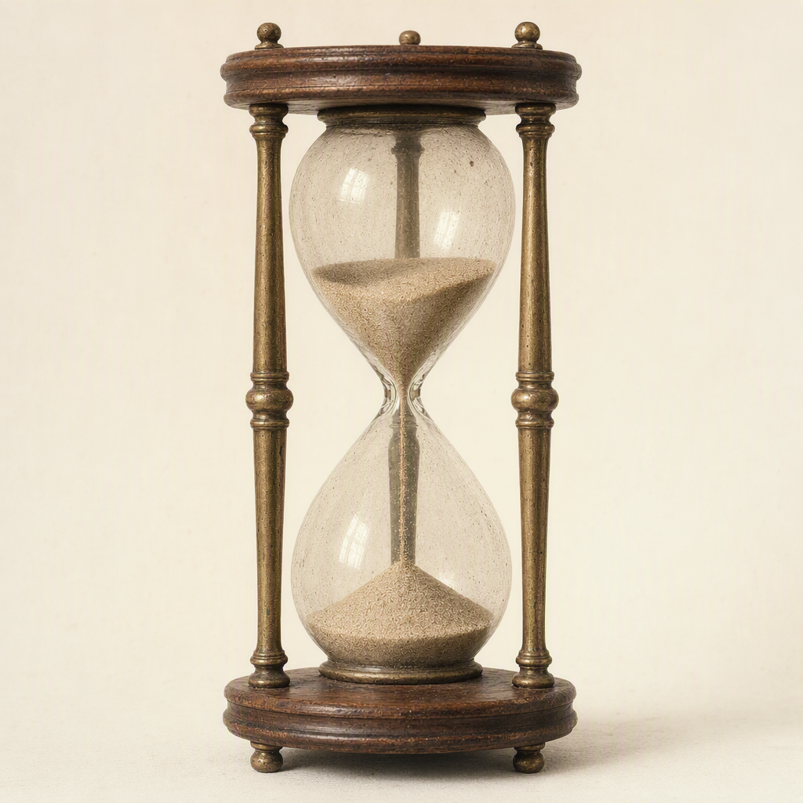

# Time's Fragile Patience

> Generated from Daybook. Do not edit as source data.

**Canonical ID:** `591c11dc-43aa-497b-8c2a-0fe6fc2d86af`  
**Status:** accepted  
**Category:** motif  
**World:** Wychcombe (`wyc`)

## Narrative Details

Time at Wychcombe does not march; it waits, accumulating in layers too fine for the eye. Paper foxes through long fidelity and brass dims as if absorbing the waiting it endures. Seeds sprout with hesitant tenderness, and roots grow deep enough to outlast their own names. Yet patience here is never passive; it is an active, fragile trust shared between the estate’s care and its artifacts. The land, the objects, and the people quietly measure themselves against limits even love cannot transcend.

## Record Images

- **Primary:** [image-primary.png](../assets/motifs/591c11dc-43aa-497b-8c2a-0fe6fc2d86af-time-s-fragile-patience/image-primary.png)

---
Generated from Daybook
Record ID: 591c11dc-43aa-497b-8c2a-0fe6fc2d86af
Last Updated: 2026-09-19T18:53:27.110Z
Snapshot Generated: 2026-09-19T18:53:27.266Z
