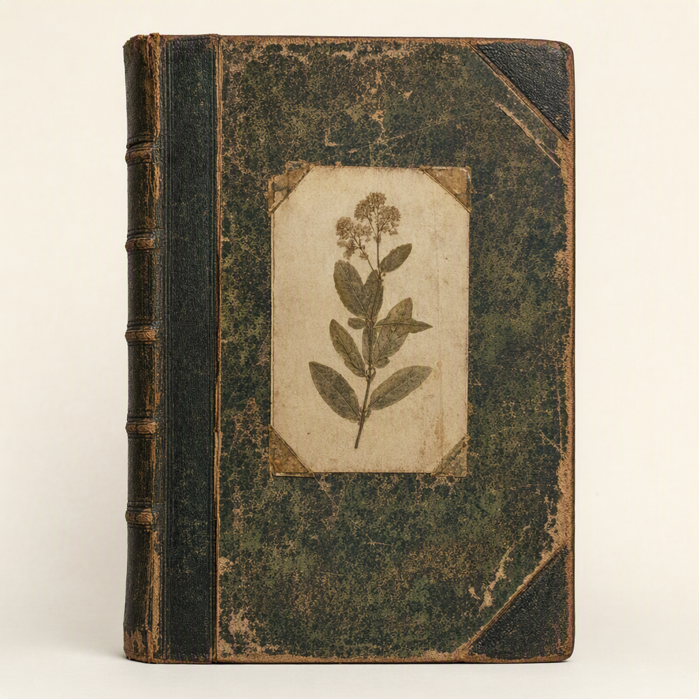

# The Ethics of Preservation

> Generated from Daybook. Do not edit as source data.

**Canonical ID:** `52e639ff-c169-45fb-ad69-f53423256abc`  
**Status:** accepted  
**Category:** object  
**World:** Wychcombe (`wyc`)

## Narrative Details

A slim, understated tome tucked away in Wychcombe’s archive, &#039;The Ethics of Preservation&#039; offers arguments and counterarguments across generations of curators. The text’s margins are thick with scrawling rebuttals, diagrams, and annotations added by scholars unwilling to leave their opinions to silence. Its pages ask hard questions: What must be preserved, and at what cost? What truths might survive neglect—and what beauties die of intervention? Its contents, shaped by urgency, carry the voices of authors whose convictions remain as sharp as their quills.

## Record Images

- **Primary:** [image-primary.png](../assets/objects/52e639ff-c169-45fb-ad69-f53423256abc-the-ethics-of-preservation/image-primary.png)

---
Generated from Daybook
Record ID: 52e639ff-c169-45fb-ad69-f53423256abc
Last Updated: 2026-09-20T02:17:33.256Z
Snapshot Generated: 2026-09-20T02:17:33.256Z
