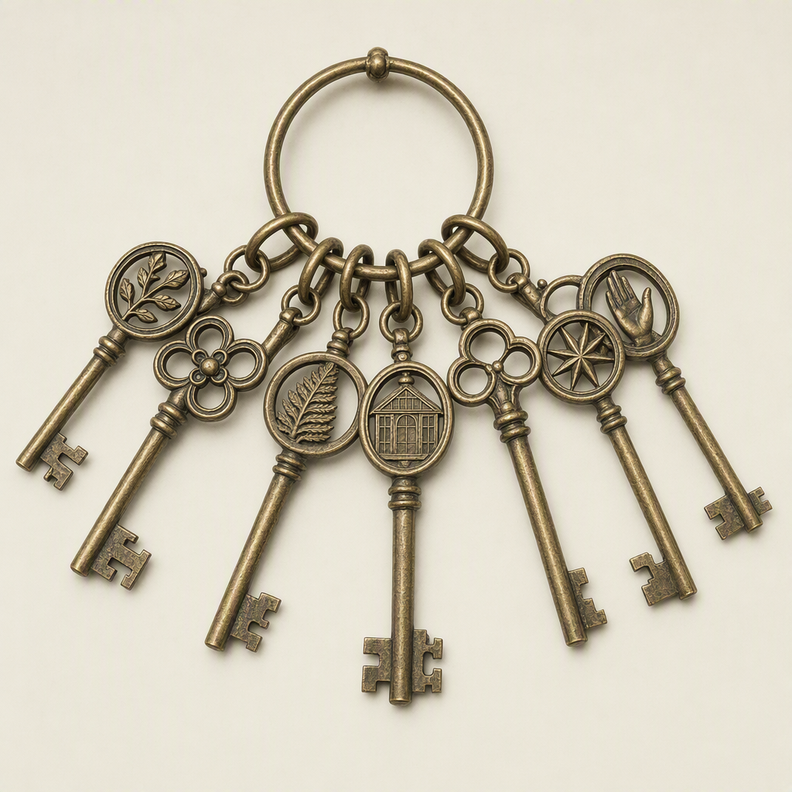

# The Seven Keys

> Generated from Daybook. Do not edit as source data.

**Canonical ID:** `b91bceb5-bbec-4492-a999-b59f2a7a1cd8`  
**Status:** accepted  
**Category:** object  
**World:** Wychcombe (`wyc`)

## Narrative Details

The Seven Keys are a linked artifact set whose individual and collective meanings connect access, inheritance, discovery, and unresolved Wychcombe history.

## Record Images

- **Primary:** [image-primary.png](../assets/objects/b91bceb5-bbec-4492-a999-b59f2a7a1cd8-the-seven-keys/image-primary.png)

---
Generated from Daybook
Record ID: b91bceb5-bbec-4492-a999-b59f2a7a1cd8
Last Updated: 2026-09-19T18:41:06.217Z
Snapshot Generated: 2026-09-19T18:41:06.393Z
