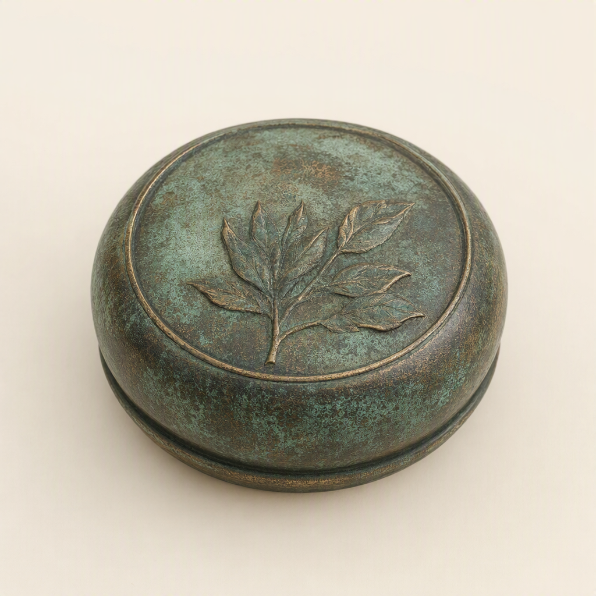

# Verdigris Paperweight

> Generated from Daybook. Do not edit as source data.

**Canonical ID:** `d9f7de7a-4b0f-45fb-b0ff-7d04ecc044df`  
**Status:** accepted  
**Category:** object  
**World:** Wychcombe (`wyc`)

## Narrative Details

Scuffed with age yet compelling in its uneven patina, the verdigris paperweight marks decades of desk-bound contemplation. Once wielded to hold correspondence secure, its weight bears the pressure of thoughts that outlast all seasons—an unchanging anchor across hands that changed too often. It is passed down without ceremony, simply taken as given.

## Record Images

- **Primary:** [image-primary.png](../assets/objects/d9f7de7a-4b0f-45fb-b0ff-7d04ecc044df-verdigris-paperweight/image-primary.png)

---
Generated from Daybook
Record ID: d9f7de7a-4b0f-45fb-b0ff-7d04ecc044df
Last Updated: 2026-09-19T18:37:44.979Z
Snapshot Generated: 2026-09-19T18:37:45.150Z
