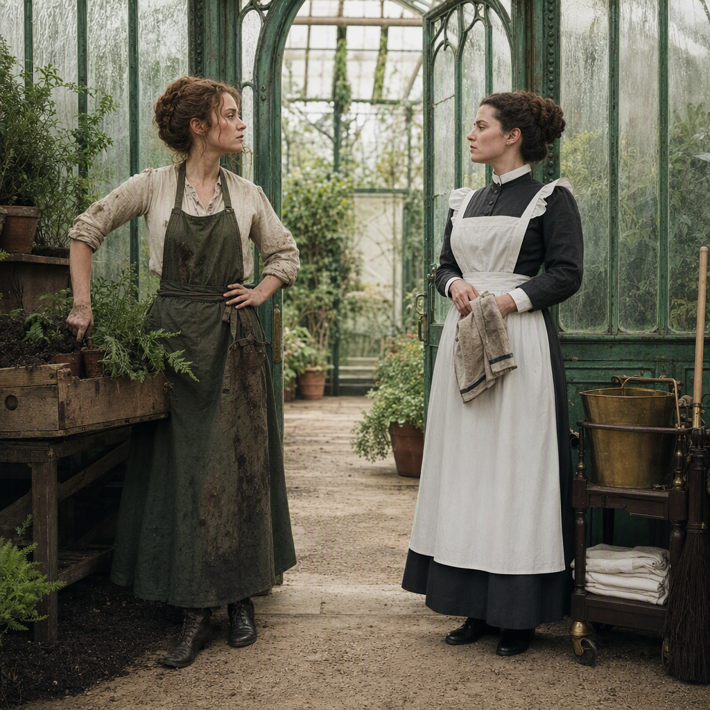

# The Seasonal Rift Between Greenhouse and Housekeepers

> Generated from Daybook. Do not edit as source data.

**Canonical ID:** `73fde2de-1540-4523-baf2-f2e093220cd9`  
**Status:** accepted  
**Category:** relationship  
**World:** Wychcombe (`wyc`)

## Narrative Details

The greenhouse staff and housekeepers wage unspoken battles each season. Greenhouse curators often shift soil-laden crates down paths swept spotless only hours before; housekeepers order window-cleaning sessions precisely when the seasonal rush of potting accidents arise. Yet one thread binds them: each tending to their own labor, each with sharpened pride in what must endure. Occasionally, shared tea carries the weight of truce — less for peace than for preservation&#039;s sake.

## Record Images

- **Primary:** [image-primary.png](../assets/relationships/73fde2de-1540-4523-baf2-f2e093220cd9-the-seasonal-rift-between-greenhouse-and-housekeepers/image-primary.png)

---
Generated from Daybook
Record ID: 73fde2de-1540-4523-baf2-f2e093220cd9
Last Updated: 2026-09-19T19:06:39.217Z
Snapshot Generated: 2026-09-19T19:06:39.406Z
